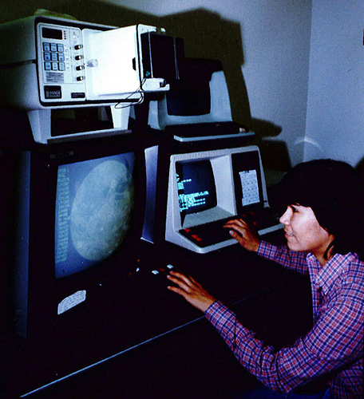
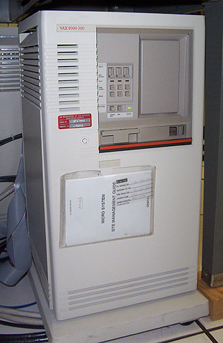
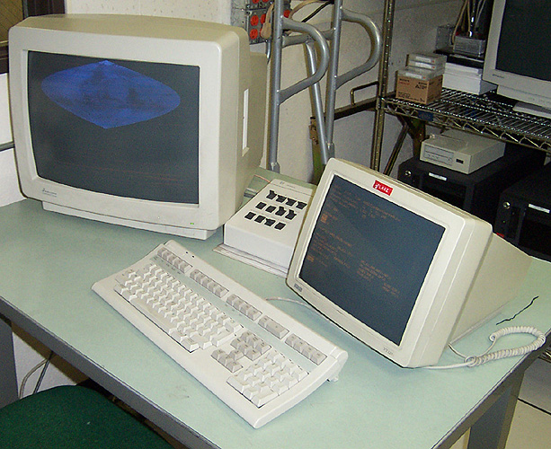
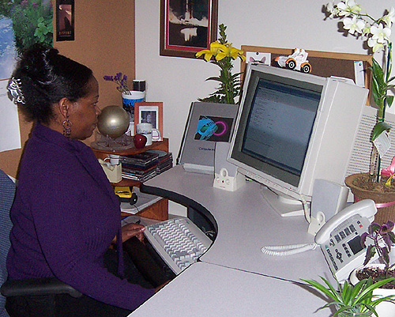
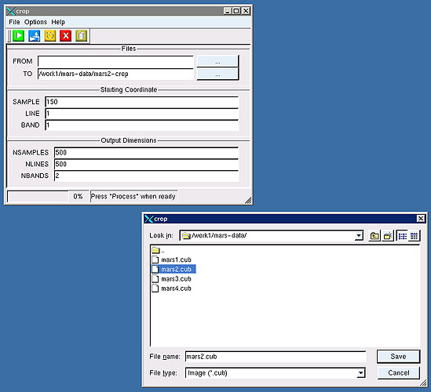
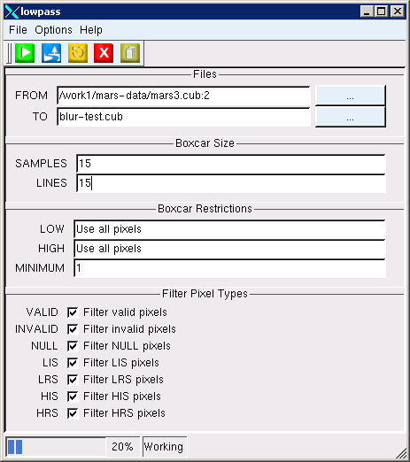
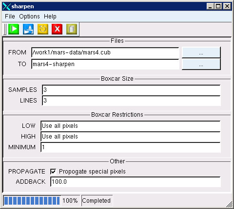

# ISIS History

*A History of USGS Astrogeology image processing software*

-----

Integrated Software for Imagers and Spectrometers (ISIS) has been a staple for the cartographic and scientific analysis of planetary image data since 1992 with a heritage reaching back to 1971. The key strength of ISIS is its ability to rigorously "control" planetary image data, calculating the proper location and orientation of the observer and the target. It is developed and maintained by the U.S. Geological Survey using funds from the NASA Planetary Geology and Geophysics Cartography Program and various U.S. and international missions. ISIS forms the backbone for some ground data systems that process raw spacecraft data into products suitable for archiving in the NASA Planetary Data System (PDS). For example, processing the Lunar Reconnaissance Orbiter Camera (LROC) and Mars Reconnaissance Orbiter (MRO) HiRISE images rely on ISIS.

The software has evolved numerous times to keep up with advances in computing technology. The following outlines the progression of the software since its inception:

<table>
    <tr>
        <th>Dates</th>
        <th>Computer</th>
        <th>Cartographic Software</th>
    </tr>
    <tr>
        <td>1971-1980</td>
        <td>PDP-11/DOS-BATCH</td>
        <td>Unnamed</td>
    </tr>
    <tr>
        <td>1978-1987</td>
        <td>PDP-11/RSX-11M</td>
        <td>Flagstaff Image Processing System (FIPS)</td>
    </tr>
    <tr>
        <td>1985-1994</td>
        <td>VAX/VMS</td>
        <td>Planetary Image Cartography System (PICS)</td>
    </tr>
    <tr>
        <td>1992-Present</td>
        <td>UNIX</td>
        <td>Integrated Software for Imagers and Spectrometers (ISIS)</td>
    </tr>
</table>

-----

## Early Years (1971-1980)

!!! note inline end ""

    

    *Computer Room*

In 1971, Astrogeology's involvement in the Apollo program ended, and many personnel in computer/cartographic related positions transferred to Earth Resources Observation and Science (EROS) Center, to other federal agencies, or took jobs in the private sector. James Crawforth (also known as Jim) and Alex Acosta remained and established a computer division to serve the Flagstaff Field Center. Development of the unnamed image processing software package began on a Digital Equipment Corporation (DEC) PDP-11/20 minicomputer with 8 K bytes of memory, two 2.5 megabyte removable disks, an 800 bpi tape drive, a card reader, and a teletype terminal. The PDP-11/20 ran a single user DOS/Batch operating system that executed programs which were read from keypunch cards. The images were printed on film transparencies with an $80,000 Optronics International Inc. filmwriter, and then viewed by the analyst.

-----

## Flagstaff Image Processing System (FIPS, 1978-1987)

!!! note inline end ""

    {align=right width=300}

    *Ella Lee using a DeAnza system to display her work*

In the late 1970s, the unnamed USGS image processing software was migrated to a DEC PDP-11/45 minicomputer with 256 KB of memory and larger 40 MB disks the size of washing machines, and ran the RSX-11M operating system. This migration allowed a host of advances such as (a) multiple users having access to the computer through VT52 black and white video terminals, (b) programmers could develop applications using as much as 32 KB of memory, and (c) a new method to view images: on a screen using a DeAnza 512x512 Frame Buffer display system! This configuration became known as the Flagstaff Image Processing System (FIPS).

-----

## Planetary Image Cartography System (PICS, 1985-1994)

!!! note inline end ""

    {align=right width=200}

    *VAX 4000*

In the early 1980s, DEC introduced their new VAX/VMS computers which allowed for virtual addressing. Developers no longer had restrictions on the size of the programs they developed. This major change in the computing environment allowed the Astrogeology programming team, led by Eric Eliason, to convert the software from FIPS to the Planetary Image Cartography System (PICS). The Transportable Application Executive (TAE) was chosen as the user interface, and the programs migrated to run on the VAX/VMS computers. The PICS software package was a popular tool in the planetary science community because of its ability to process Viking Orbiter, Voyager, Magellan, Landsat, and various other spacecraft imagery.

-----

!!! note inline end ""

    {align=right width=200}

    *Grinnell System*

!!! note ""

    {align=right width=300}

    *Grinnell Workstation*

-----

## Integrated Software for Images and Spectrometers (ISIS 2, 1992-2005)

In the late 1980s, the requirement to handle large volumes of complex data acquired by new instruments significantly changed the requirements on Astrogeology's imaging processing software. PICS could only handle images with 7 or fewer bands, and left the user to manage each band as a separate file. The Galileo mission's Near-Infrared Mapping Spectrometer (NIMS) instrument, a hyperspectral imager capable of collecting images with up to 408 bands, was the first to show the limitation of the PICS software. To efficiently handle many bands for a single image, the PICS software package had to be fundamentally redesigned. The new package, the Integrated System for Imaging Spectrometers (ISIS) came into existence under the guidance of the designer Jim Torson and developer Kris Becker. After passing through an internal version 1.0 prototype, this software was released as ISIS 2.0.

In the early 1990s, the Clementine mission collected hundreds of thousands of images with the Ultraviolet/Visible (UVVIS) and Near-Infrared (NIR) cameras. The hardware and software requirement to process the large volume of data led to a transition to new hardware and the use of the Oracle data base system to streamline the processing methods. Perl scripts were used to run repetitive tasks and also introduced at this time. These innovations were largely incompatible with PICS.

!!! note inline end ""

    { align=right width=300 }

    *Janet Richie uses TAE for her processing work*

Cost also drove the change from PICS to ISIS. PICS operated on the aging and expensive VAX/VMS computer system. The planetary community often lamented the $50,000 price tag for a single machine with a display device. At this time, UNIX began to make a push in the computing world. Astrogeology's computer group decided to merge the PICS and ISIS software and move to the SunOS and DEC OSF1 platforms under the UNIX operating system. The integration of PICS and ISIS was led by Kay Edwards, leading to the creation of ISIS 2.1.

During the late 1990s, ISIS continued to grow in both number of applications and the supported operating systems. Software to process data from Galileo Solid State Imager, Imager for Mars Pathfinder, Mars Global Surveyor Mars Orbiter Camera, Mars Odyssey THEMIS, and other instruments were added. The software was ported to the Linux operating system as the demand for cheaper computers with "Open-source software" increased. The ISIS 2.1 display software allowed for visual image analysis directly on the user's desktop instead of requiring specialized monitors. ISIS made huge gains in usage by non-USGS customers, especially with the increased focus on cartographic processing. With the popularity of the ISIS software package, the meaning of the acronym "ISIS" was changed to Integrated System for Imagers and Spectrometers.

## ISIS 3 (2005-Current)

By 2001, Astrogeology recognized that the cost and time to maintain the ISIS software package was becoming more difficult as different components of the software system became obsolete or became harder to manage. Users constantly asked for TAE to be replaced by a standard Graphical User Interface (GUI). The ISIS development staff could not use some of the powerful debugging tools that were available, because they did not function well on computer code written in Fortran or C. Many of the Open-source Application Program Interfaces (APIs) were only available in C++ or Java, and thus not available for usage in ISIS. The cube file formats did not efficiently support missions that acquired data with line scan cameras. In order to take advantage of new capabilities in the computer technology, the decision was made to modernize ISIS. Jeff Anderson led the effort to convert the ISIS programs written in Fortran/C to C++, creating ISIS 3.

### Screenshots of ISIS Application GUIs

The GUIs replaced the outdated TAE interface in ISIS. Programs now have meaningful names and are task-specific so that ISIS is easier and faster to use.

??? abstract "Crop"

    All programs have dialog boxes for selecting files to process, as shown in this screenshot. `Crop` was called `dsk2dsk` in earlier versions of ISIS, one of many programs renamed to more meaningful names in ISIS 3.

    

    

??? abstract "Lowpass"

    `Lowpass` is one of several task-specific programs that was once part of the `boxfilter` program.
    
    

??? abstract "Sharpen"

    `Sharpen` is another task-specific program that was once part of the `boxfilter` program. With the original boxfilter program broken into several smaller programs, fewer parameters are required. The program names are more meaningful making ISIS easier to learn and use.

    

A second driver for the creation of ISIS 3 was a new wave of instruments that produced gargantuan images. For example, the Mars Reconnaissance Orbiter HiRISE camera routinely acquires 1000 Megapixel images. Even more challenging was the need to produce controlled mosaics consisting of thousands of large images from the Lunar Reconnaissance Orbiter Camera Narrow Angle Camera (NAC). Solving for the position and orientation of the spacecraft required handling complex manipulations of extremely large matrices. Even the efficient access of ancillary data, historically stored as text in file headers, became an issue. ISIS 3 underwent a series of major updates to improve the efficiency and accuracy of the map projected output from the software.

## Major Version of ISIS

<table>
    <tr>
        <th>
            Version
        </th>
        <th>
            Date
        </th>
        <th>
            Description
        </th>
    </tr>
    <tr>
        <td>
            1.0
        </td>
        <td>
        Late 1980s
        </td>
        <td>
            Prototype software, converted from PICS
        </td>
    </tr>
    <tr>
        <td>
            2.0
        </td>
        <td>
        1989
        </td>
        <td>
            First official release for VAX/VMS
        </td>
    </tr>
    <tr>
        <td>
            2.1
        </td>
        <td>
        1993
        </td>
        <td>
            Ported to UNIX
        </td>
    </tr>
    <tr>
        <td>
            3.0.0
        </td>
        <td>
        2/27/2004
        </td>
        <td>
            Rewritten in the C++ programming language for Linux
        </td>
    </tr>
    <tr>
        <td>
            3.0.03
        </td>
        <td>
        3/9/2005
        </td>
        <td>
            Beta release, modernized the ISIS software package by
        upgrading many of the programs
        </td>
    </tr>
    <tr>
        <td>
            3.1.0
        </td>
        <td>
        10/1/2006
        </td>
        <td>
            Upgraded to process file sizes greater than 2 GB
        </td>
    </tr>
    <tr>
        <td>
            3.2.0
        </td>
        <td>
        3/18/2010
        </td>
        <td>
            Overhauled how ancillary text data are handled
        </td>
    </tr>
    <tr>
        <td>
            3.3.0
        </td>
        <td>
        10/11/2011
        </td>
        <td>
            Overhauled control network software to handle binary data
        </td>
    </tr>
    <tr>
        <td>
            3.4.0
        </td>
        <td>
        5/21/2012
        </td>
        <td>
            Overhauled projection classes to improve speed
        </td>
    </tr>
    <tr>
        <td>
            3.4.5
        </td>
        <td>
        1/14/2014
        </td>
        <td>
            Overhauling camera models for improved accuracy and increased 
        generality
        </td>
    </tr>
</table>

## Ongoing Development

Today, ISIS 3 continues to evolve to meet the needs of users within and outside the Astrogeology Science Center. It remains the premier software package for putting pixels in the correct location in digital space. Releases of new versions occur about 4 times a year, with major releases every year or two. Experience suggests that this pace strikes the right balance between stability and timely improvements to ISIS 3. It should be noted that the data ISIS uses (e.g., SPICE) are frequently updated and small patches are sometimes put out in between the scheduled releases.

-----

## Document History

| Contrubutor         | Date       | Changes                                                                |
|---------------------|------------|------------------------------------------------------------------------|
| Jeff Anderson       | 2003.03.25 | Original document.                                                     |
| Kimberly Sides      | 2003.04.02 | Photographs of computer systems, scans of historical photographs.      |
| Deborah Lee Soltesz | 2003.04.07 | Dressed up formatting, embedded images.                                |
| Ella Mae Lee        | 2013.11.22 | Removed Current Events and updated History sections.                   |
| Adam Paquette       | 2019.03.29 | Removed link to Isis install page.                                     |
| Jacob Cain          | 2024.10.07 | Moved/reformatted page as part of effort to consolidate documentation. |