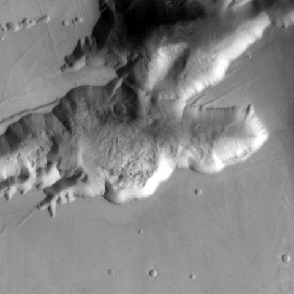
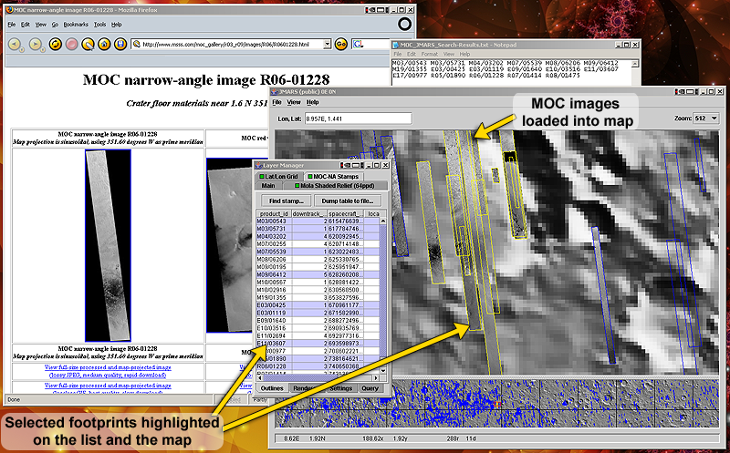
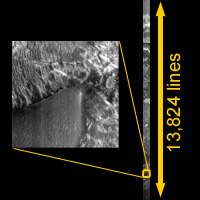
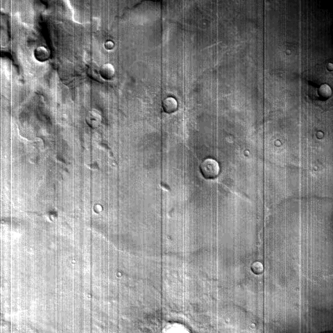
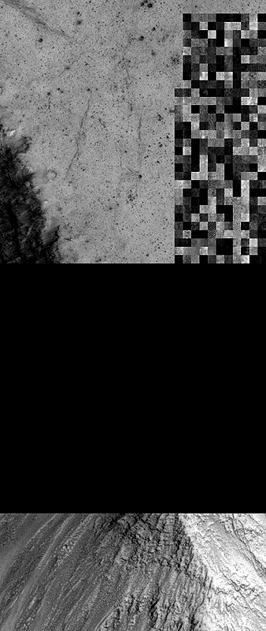
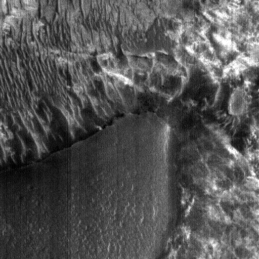
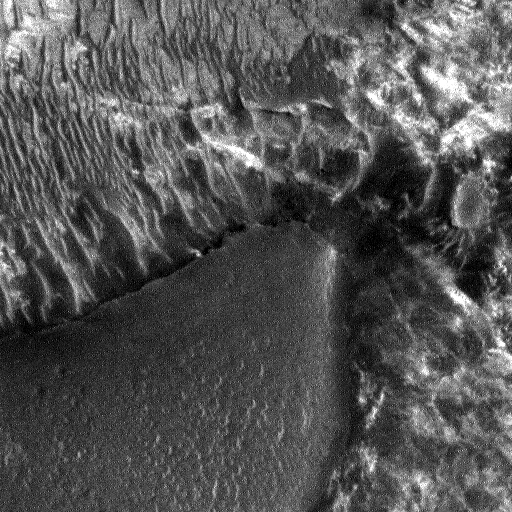
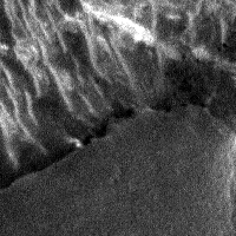
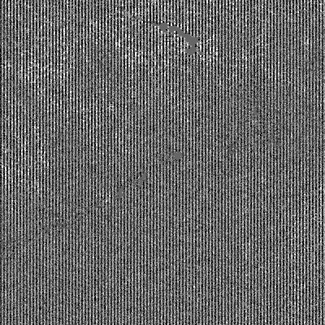

# Working with Mars Orbiter Camera Data

## The Mars Orbiter Camera Instrument

The Mars Orbiter Camera (MOC) onboard
[**MGS**](../../../concepts/missions/mgs/index.md) produced a daily wide-angle
image of Mars, similar to weather photographs of the Earth, and took narrow angle images. 
*Malin Space Science Systems* was responsible for MOC operations from 1996 to 2006.

-----

The MOC consists of three cameras, all supported by ISIS:

<div class="grid cards" markdown>

- **Wide Angle (WA) camera (red)**
    - Resolutions: 
        - *Context Images:*  
           240 meters/pixel
        - *Lowres Global Images:*  
           7.5 kilometers/pixel

- **Wide Angle (WA) camera (blue)**

    - Resolutions: 
        - *Context Images:*  
           240 meters/pixel
        - *Lowres Global Images:*  
           7.5 kilometers/pixel

- **Narrow Angle (NA) camera (greyscale)**

    - Resolution: highres 1.5 to 12 meters/pixel

</div>

The cameras are **pushbroom scanners** (also called along-track
scanners), capturing one line of data at a time as the spacecraft
orbits the planet. For details about the MGS mission and the MOC cameras,
refer to the PDS MOC archive documents that are distributed with the
image data. Information can be found on the 
***Mars Global Surveyor Science Sampler Data Set Collection*** 
[[Volume]](https://planetarydata.jpl.nasa.gov/img/data/mgs-m-moc-4-sampler-v1.0/mgs_0001/) 
[[Info]](https://planetarydata.jpl.nasa.gov/img/data/mgs-m-moc-4-sampler-v1.0/mgs_0001/document/volinfo.htm).

??? info "Images Types for MOC Cameras"

    <div class="grid cards" markdown>
    
    -   [{align=left width="50"}](assets/moc-img/Mars_Orbital_Camera_Wide_Red.png "Mars_Orbital_Camera_Wide_Red.png")  
        **Wide Angle (Red Band)**
    
        Summing Mode: 27   
        Res: ~6.7 kilometers/pixel

        This image is mirrored and will need to be flipped during processing.

    - **Higher Resolution Wide Angle (Red Band)**  
    
        [{align=right width="100"}](assets/moc-img/Mars_Orbital_Camera_High_Wide_Red.png "Mars_Orbital_Camera_High_Wide_Red.png")  
          
        Summing Mode: 1  
        Res: ~250 meters/pixel  
        
        In summing mode 1, detector 
        readings are not combined. This image is mirrored 
        and will need to be flipped during processing.

    - [{align=left width="50"}](assets/moc-img/Mars_Orbital_Camera_Wide_Blue.png "Mars_Orbital_Camera_Wide_Blue.png")
        **Wide Angle (Blue Band)**

        Summing Mode: 27   
        Res: ~6.7 kilometers/pixel
        
        Summing modes are utilized 
        on-board the spacecraft to average detector 
        readings to combine them into a single output 
        pixel value.

    - [{align=right width="50"}](assets/moc-img/Mars_Orbital_Camera_Narrow.png "Mars_Orbital_Camera_Narrow.png")
        **Narrow Angle**

        Res: ~1.5 meters/pixel

    </div>

### Related Resources

  - JPL
    - [MOC Specification](https://planetarydata.jpl.nasa.gov/img/data/mgs-m-moc-4-sampler-v1.0/mgs_0001/document/volinfo.htm#4.1%20Mars%20Orbiter%20Camera%20(MOC))
    - [MGS Spacecraft](https://web.archive.org/web/20161015173825/http://mars.jpl.nasa.gov/mgs/mission/spacecraft.html) (Archived)
    - [MGS Science Instruments](https://web.archive.org/web/20160401010931/http://mars.jpl.nasa.gov/mgs/mission/sc_instruments.html) (Archived)
  - [NASA - Mars Global Surveror](https://science.nasa.gov/mission/mars-global-surveyor/)
  - [MSSS (Malin Space Science Systems) - MGS](http://www.msss.com/all_projects/mgs-mars-orbiter-camera.php)

-----

## Processing MOC Data Overview

  - **Level 0** - Data Ingestion
      - The MOC images are downloaded to a local workstation. The labels
        are updated with ISIS keywords, and the filenames containing
        information about the geometry of the image is added to the
        labels.
  - **Level 1** – Radiometric Calibration and Noise Removal
      - The noise and pixel spikes that are introduced during image
        acquisition are removed to create an ideal grayscale image
        representing reflectance values (ranging from 0 to 1 DN value).
  - **Level 2** - Projection
      - Geodetic corrections are performed and the images projected to a
        map projection.
  - **Level 3** – Photometric Correction and Enhancement
      - The effect of sun angle on the image is corrected, and the
        images are tone matched.
  - **Level 4** – Building a Mosaic
      - A seamless mosaic is created.

## Level 0 Processing - Data Ingestion

-----

This is the starting point for the production of a MOC mosaic. The steps
within the level zero processing provide the gateway into ISIS
processing. Running the following applications will **ingest the MOC
Standard Data Products** (and MOC Standard Decompressed Data Products)
and place necessary information into the labels of the image.

### Acquiring MOC Data

??? info "Data Sources"

    There are numerous online resources and desktop tools for searching for
    and acquiring Mars Global Surveyor Mars Orbiter Camera image data.

    #### PDS Planetary Image Atlas

    The [PDS Planetary Image Atlas](https://pds-imaging.jpl.nasa.gov/search/?fq=ATLAS_MISSION_NAME%3A%22mars%20global%20surveyor%22&q=*%3A*), 
    hosted by JPL and USGS Astrogeology, is a search tool for MOC database and select images.

    #### Browsing by Volume

    The [Mars Global Surveyor Online Data Volumes](https://pds-imaging.jpl.nasa.gov/volumes/mgs.html)
    allows manual browsing of the data in the original CD format.

    #### ASU JMARS Geographic Information System

    The [JMARS Geographic Information System (GIS)](http://jmars.asu.edu/),
    offered by the Arizona State University's Mars Spaceflight Facility, is a 
    desktop tool for searching for and viewing MOC images.

    #### Related Resources

    - [PDS Data Holdings - MGS](http://pds-imaging.jpl.nasa.gov/holdings/#mgs)
    - [PDS Image Atlas Search (Mission: MGS)](https://pds-imaging.jpl.nasa.gov/search/?fq=ATLAS_MISSION_NAME%3A%22mars%20global%20surveyor%22&q=*%3A*)
    - [JMARS Geographic Information System (GIS)](http://jmars.asu.edu/)

??? info "Data Acquisition Tool: Planetary Image Atlas"

    The [PDS Image Atlas (Mission: MGS)](https://pds-imaging.jpl.nasa.gov/search/?fq=ATLAS_MISSION_NAME%3A%22mars%20global%20surveyor%22&q=*%3A*) 
    provides a search tool for MGS MOC (and other) imagery. 
    Make sure that the mission or spacecraft `mars global surveyor`, or that `moc` is selected as the instrument.

    Here are few useful filters for narrowing your search.  They can be found in the left column of the PDS Image Atlas:

    | Parameter                       | Notes                                                                                                                                                                                |
    | ------------------------------- | ------------------------------------------------------------------------------------------------------------------------------------------------------------------------------------ |
    | **Filters**                     | Red and Blue filters are Wide Angle Imagery.  N/A (no filter) may help you find Narrow Angle Imagery.
    | **Lat/Lon Bounding Box**        | Enter the Min and Max Longitudes and/or Latitudes of your area of interest.  Longitude is in Positive East coordinates.
    | **Target**                      | Select `Mars` to filter out the few non-mars MOC Images.
    | **Orbital Mission Constraints** | Orbit Number, Azimuth, Rotation, Ascension, Declination, Spacecraft Orientation, etc...
    | **Lighting Geometry**           | Emission Angle, Incidence Angle, Phase Angle.  Helpful for finding similarly lighted images to build a mosaic.

??? info "Data Acquisition Tool: JMARS"

    JMARS is a Geographic Information System (GIS) tool to evaluate
    MOC images that cover an area of interest before the images are
    downloaded. The tool displays MOC footprints and a variety of other Mars
    data. JMARS can be used to:

    - Query the database of MOC images
    - Select browse images to display on-screen and download via the web
    - Generate a list of MOC images (great for creating scripts)
    - Save the displayed map as an image

    ??? abstract "Screenshot - JMARS displaying MOC Footprints"

        [](assets/moc-img/Jmars_Screenshot.png "Jmars_Screenshot.png")

        The MOC footprints (called stamps in JMARS) are displayed as blue polygons on the map. 
        Several footprints are shown selected in the Layers Manager MOC-NA Stamps list 
        and highlighted yellow on the map. Several MOC images are displayed the 
        map, filling in those footprints with a preview of the actual image data. 
        The web page for one image has been launched and is open behind JMARS, 
        and the image names for the selected footprints have been copied from JMARS to our text editor.

    ??? example "Example - Displaying MOC Narrow Angle Footprints in JMARS"

        If you have JMARS installed, launch it and log in.

        - In the *Main* tab of the **Layer Manger** , hit the **Add new
        layer** button, which opens a menu.
        - Select **Moc** from the **Stamp** menu.
        - In the **Add Moc stamp layer** window, just hit the Okay button,
        leaving all the fields blank.
        - A new tab named **MOC-NA stamps** will appear in the Layer Manager.
        When it's done loading the footprints, its drawing status indicator
        will turn from red to green, the footprints will be displayed on the
        map and the images shown on the map are list in the Layer Manager.
        - Try right-clicking on a listing the image list and on the footprints
        displayed on the screen -- there's lots of options for working with
        and accessing information and data. For example, **Render** and
        **Load Selected Stamps** will download and display the MOC images
        for the selected footprints on the map, giving you the ability to
        preview the data. **Web Browse** will launch an image's web page in
        your browser so you can access the information and data.

    Other options in JMARS to help you search for MOC data include:

    - Tools for narrowing your search and modifying your display in the 
    **Settings**, **Query**, and **Render** tabs in the Layer Manager
    - Tools in the main menus
    - Adding other data layers to the display

    <div class="grid cards" markdown>

    - **See [JMARS (ASU) :octicons-arrow-right-24:](http://jmars.asu.edu/)**  
      *Free, registration required for full functionality*

    </div>

-----

### Importing MOC Data

The **Standard Decompressed Data Products**, which have an .img
extension and are in PDS image format, are ingested directly into
ISIS. The **Standard Data Products**, which have an .imq extension,
are compressed PDS format images and are decompressed during ingestion
into ISIS.

### Using moc2isis to ingest MOC images into ISIS

??? info "Ingesting (and decompressing) a MOC image with `moc2isis`"

    To import an a MOC image into ISIS with [`moc2isis`](https://isis.astrogeology.usgs.gov/Application/presentation/Tabbed/moc2isis/moc2isis.html), outputting an ISIS cube:

    === "Decompressed"

            moc2isis from=r0700563.img to=r0700563.lev0.cub

    === "Compressed"

            moc2isis from=r0700563.imq to=r0700563.lev0.cub

    The decompression software for the .imq images is included within
    `moc2isis`; you don't need to worry about the extra step of
    decompressing the image.

    -----

    <div class="grid cards" markdown>

    - MOC Narrow Angle Raw Image  
      ***Subarea***

        [{width="200"}](assets/moc-img/MOC_Narrow_Angle_Raw_Subarea.png "MOC_Narrow_Angle_Raw_Subarea.png")

        Original image is 512 samples by 13,824 lines. 
        This image is a subarea that was cropped from 
        lines 11,800-12,312 of the original (full 
        width, i.e. 512 samples across) image, r0700563

    - MOC Narrow Angle Raw Image  
      ***Full Scene***

        [](assets/moc-img/MOC_Narrow_Angle_Raw_Full_Thumb.png "MOC_Narrow_Angle_Raw_Full_Thumb.png")

        This illustrates where the subarea (left) 
        was pulled from the original image (r0700563).

    </div>

??? info "Decompressing MOC Images outside of `moc2isis`"

    !!! quote inline end ""
        [{ width="200" }](assets/moc-img/MOC_Wide_Red.png "MOC_Wide_Red.png")
        /// caption
        **MOC Wide Angle, Red Band (e2000929)**
        ///

    If you'd like to decompress the MOC image outside of the ISIS
    `moc2isis` app, use the 
    [`mocuncompress`](https://isis.astrogeology.usgs.gov/9.0.0/Application/presentation/Tabbed/mocuncompress/mocuncompress.html) 
    app. `mocuncompress` is not a standard ISIS app; the command must
    be entered exactly as shown below. There is no GUI. 
    (This application is supplied by Planetary Data System).

    **mocuncompress Syntax:**

        mocuncompress [input file] [output file]

    **mocuncompress Example:**  
    *.img* is the recommended file extension
    for the uncompressed output file.

        mocuncompress e2000929.imq e2000929.img

    To import the resulting uncompressed image into ISIS,
    run `moc2isis` on the uncompressed file. For example:

        moc2isis   from=e2000929.img  to=e2000929.lev0.cub

??? warning "MOC Problem Data"

    !!! quote inline end "Transmission Error"

        [{width="100"}](assets/moc-img/Noise_Transmission_Error.png "Noise_Transmission_Error.png")
        /// caption
        A glitch during the transmission of this image 
        caused the data to become garbled (upper right) 
        and some data was completely lost 
        (the black area across the middle)
        ///

    Many of the problems with the MGS MOC data sets are due to either
    transmission errors or environmental conditions that existed when the
    image was acquired. It may be hard to detect these errors without visually
    inspecting the images.  While many predicted problems are easily handled
    through standard MOC processing procedures, **missing data**,
    **corrupted data**, and other random data acquisition and transmission
    issues may require special processing, manual editing, or simply cannot
    be corrected. **Clouds** and **airborne dust** are two elements, caused
    by environmental conditions, that will degrade the quality of your
    images. The amount of image degradation will vary. 

    The decision whether to use image is a judgment based on ***how much
    information will be gained*** vs. ***how much the image will degrade*** the
    final product.

<div class="grid cards" markdown>

- See Also: [Spice Overview :octicons-arrow-right-24:](../../../concepts/spice/spice-overview.md)

</div>

-----

## Level 1 Processing - Noise Removal and Radiometric Calibration

To create a Level 1 MOC image, we'll clean up noise and other problems
and radiometrically correct the data so we have an image representing
the reflectance of the surface. We'll start by removing image defects
caused by malfunctioning detectors, dust specks, transmission noise, and
so forth. We'll finish up our Level 1 image with radiometric calibration
in order to create an image that is representative of an ''ideal'' image
acquired by a camera system with perfect radiometric properties.

??? info "Radiometric Calibration with `moccal`"

    The radiometric calibration application moccal corrects an image so the
    output resembles an "ideal" grayscale image where the digital numbers
    (DNs) are proportional to scene brightness. The images are corrected
    for:

    - Global gain and offset instrument operating modes
    - Variable sensitivity of each detector in push broom array
    - Even/odd detector offset
    - Normalize sun-target distance
    - Low-high-low spike at 50 pixel intervals caused by power supply
        synchronization pulse

    Occasionally, corrupted pixels need to be set to null pixel values.

    [`moccal`](https://isis.astrogeology.usgs.gov/Application/presentation/Tabbed/moccal/moccal.html)
    is intended to run on MOC Narrow Angle and Wide Angle images. The
    default output image is a 32-bit cube where the pixels have been
    adjusted to represent **reflectance** (i.e. albedo), with valid pixel
    values between 0 and 1. (Alternatively, you can create a radiance image,
    with units in DN/msec, by setting the IOF parameter to "NO").

    ???+ example "Default Coefficients"

        Default coefficients for the MOC calibration correction can be found in:

            $ISISDATA/mgs/calibration/moccal.ker.\#

        *`\#` is the version number, moccal will refer to the highest version number as most recent.*

    -----

    ???+ example "Radiometric Corrections"

        This will perform radiometric corrections to
        our image (r0700563.lev0.cub) and create an output cube
        (r0700563_cal.cub) where the DNs represent reflectance (I/F, ratio of
        reflected radiation and the amount of incident radiation).

            moccal from=r0700563.lev0.cub to=r0700563_cal.cub

        <div class="grid cards" markdown>

        - **Pre-Calibration**

            [{width="300"}](assets/moc-img/MOC_Pre_Calibration.png "MOC_Pre_Calibration.png")

        - **Post-Calibration**

            [{width="300"}](assets/moc-img/MOC_Post_Calibration.png "MOC_Post_Calibration.png")

        </div>

<div class="grid cards" markdown>

- See Also: [General Overview of Radiometric Calibration :octicons-arrow-right-24:](../../../concepts/image-processing/overview-of-radiometric-calibration.md)

</div>

-----

??? info "Noise Removal: MOC Wide Angle vs. Narrow Angle"

    So far, we've been handling MOC Wide Angle and MOC Narrow Angle images
    the same. Now, we need to diverge and do some special processing to some
    of our images, and images from both cameras will be handled differently.

    The MOC camera characteristics produce images with known noise patterns.
    The noise patterns differ according to the ***lens angle*** (wide or narrow), the
    cameras' ***summing mode*** (crosstrack or downtrack), or **color** (blue or red).
    These known noise issues are easy to correct. After correction,
    processing can continue (i.e, projecting the image to a map projection).

    #### Crosstrack Summing Modes

    Particular **summing modes** were used 
    to average multiple detector pixels and combine them into a single 
    output pixel value. Both MOC NA and WA detectors can utilize crosstrack
    (sample) and downtrack (line) summing modes. The value of these modes
    indicate the number of samples and lines, respectively, that were summed
    and averaged to result in the pixel values stored in the raw file.

    #### Key ISIS Applications

    - [`mocnoise50`](https://isis.astrogeology.usgs.gov/Application/presentation/Tabbed/mocnoise50/mocnoise50.html)
        : removes diagonal spike noise from MOC NA images with
        Crosstrack Summing mode of `1`
    - [`getkey`](https://isis.astrogeology.usgs.gov/Application/presentation/Tabbed/getkey/getkey.html)
        : outputs the value of requested keyword from cube label

    ??? example "50-pixel Noise Spike (MOC Narrow Angle)"

        The images acquired by MOC Narrow Angle (NA) when the camera was in
        **crosstrack summing mode 1** contain a noise spike pattern every 50
        pixels.

        To find out if your image has this issue, extract the CrosstrackSumming
        and InstrumentId keywords from your MOC image to determine camera
        (Narrow Angle or Wide Angle) and camera crosstrack summing mode (modes
        range from 1 to 8 for MOC NA):

            getkey from=r0700563_cal.cub grpn=Instrument keyword=CrosstrackSumming
            getkey from=r0700563_cal.cub grpn=Instrument keyword=InstrumentId

        If the values returned are CrosstrackSumming=1, and
        InstrumentId=MOC\_NA, run the **mocnoise50** application to remove the
        noise spikes.  

        *Note:* `mocnoise50` *will check the InstrumentId and
        CrosstrackSumming keywords for you and only run on images that have the
        correct values.*

            mocnoise50 from=r0700563_cal.cub to=r0700563_noise.cub

        The images below have been cropped and magnified to show the results of
        mocnoise50 program.

        <div class="grid cards" markdown>

        - **Before mocnoise50**

            [{width="300"}](assets/moc-img/MOC_Before_Mocnoise50.png "MOC_Before_Mocnoise50.png")
            
            The bright pixels forming a pattern of parallel lines that appear to 
            run towards the upper right is the spike noise we want to remove.

        - **After mocnoise50**
            
            [{width="300"}](assets/moc-img/MOC_After_Mocnoise50.png "MOC_After_Mocnoise50.png")

            The noise spike pattern has been removed.

        </div>

    ??? example "Even-Odd Noise Removal (MOC Narrow and Wide Angle)"

        The Narrow Angle (NA) and Wide Angle (WA) images contain a noise pattern
        across even and odd pixels whenever the cameras were in crosstrack
        summing mode 1. The application **mocevenodd** gathers an average of the
        pixels to remove the noise pattern. The changes are very subtle, so it
        is very hard to see the differences visually. The pixel values are
        different if viewed with an interactive display program like qview.

        To find out if your image has this issue, extract the CrosstrackSumming
        keyword from your MOC image to determine the camera crosstrack summing
        mode (modes range from 1 to 8 for MOC NA and 1 to 127 for MOC WA):

            getkey from=e2000929_cal.cub grpn=Instrument  keyword=CrosstrackSumming

        If the crosstrack summing mode is 1 (i.e. CrosstrackSumming=1), run the
        **mocevenodd** application.  
        *Note:* `mocevenodd` *will check the CrosstrackSumming keyword for
        you and only run on images that have the correct value.*

        === "Narrow Angle"

            For MOC NA images, run
            `mocevenodd` on the output of `mocnoise50`:

                mocevenodd from=r0700563_noise.cub to=r0700563.lev1.cub
        
        === "Wide Angle"

            For MOC WA images, run
            `mocevenodd` on the output of `moccal`:

                mocevenodd from=e2000929_cal.cub to=e2000929.lev1.cub

        -----

        The images below have been cropped and magnified to show the results of
        mocevenodd program.

        <div class="grid cards" markdown>

        - **MOC NA image, before mocevenodd**

            [](assets/moc-img/MOC_Before_Mocevenodd.png "MOC_Before_Mocevenodd.png")

        - **MOC NA image, after mocevenodd**

            [](assets/moc-img/MOC_After_Mocevenodd.png "MOC_After_Mocevenodd.png")


        - **Difference image**

            [](assets/moc-img/MOC_Mocevenodd_Difference.png "MOC_Mocevenodd_Difference.png")
            
            This image illustrates the difference between the before and after 
            images. Note the vertical "pin-striping" -- this is the even-odd 
            noise pattern that was fixed by mocevenodd. This image is a literal 
            subtraction of the two images, contrast stretched to exaggerate 
            the differences. In this images, dark tones are pixels that became 
            darker after mocevenodd, and the lighter tones are pixels that became
            lighter after mocevenodd.

        </div>


    ??? example "Gap Noise Removal (MOC Wide Angle)"

        The Wide Angle camera that acquired images in the blue filter contains a
        gap at detector 371. This gap can be filled in with the average of
        surrounding pixels (five pixels on a line centered on detector 371).
        Referring to the extracted label information, if InstrumentId = MOC\_WA,
        then determine if it is a blue filter:

            getkey from=file_mocevenodd.cub grpn=Archive  keyword=FilterName

        If FilterName = BLUE then apply
        [`mocgap`](https://isis.astrogeology.usgs.gov/Application/presentation/Tabbed/mocgap/mocgap.html)
        to the appropriate output from the steps above:

        - If MOC_WA / CrosstrackSumming = 1

        ```
        mocgap  from=file_mocevenodd.cub  to=file.lev1.cub
        ```

        - Or... if MOC_WA / CrosstrackSumming is ***not equal to*** 1:

        ```
        mocgap from=file_cal.cub to=file.lev1.cub
        ```

<div class="grid cards" markdown>

- See Also: [General Overview of Noise and Artifacts :octicons-arrow-right-24:](../../../concepts/image-processing/overview-of-noise-and-artifacts.md)

</div>

-----

## Level 2 Processing - Geometry

Producing a mosaic requires **geometric processing** on the individual
images that make up the desired mosaic. The individual images are
geometrically transformed from *spacecraft camera orientation to a
common map coordinate system*. ISIS has generic software applications
that are applied to all supported mission data. Based on the information
in the image labels that was added in our earlier steps, the software
recognizes the instrument and performs accordingly.

Within ISIS, the geometric software includes correcting **camera
distortions** for each supported instrument. The camera distortion
correction and geometric transformation are performed simultaneously so
that an image is resampled only once and resolution loss is minimal. The
transformation is based on the original viewing geometry of the
observation, relative position of the target and the definition of the
map projection.

<div class="grid cards" markdown>

- See Also: [Map Projecting Images :octicons-arrow-right-24:](../../../how-to-guides/image-processing/map-projecting-images.md)

</div>

-----

## Level 3 Processing - Photometric Correction

**Currently, ISIS photometric correction capabilities are under
development. When the applications are released, we will develop a page
here in this lesson providing you with examples and tips for using ISIS
photometric correction tools.**

*Photometric normalization* is applied to all images that make up a
mosaic in order to adjust and balance the brightness levels among the
images that were acquired under the different lighting conditions.

Generally, radiometrically calibrated spacecraft images measure the
brightness of a scene under specific angles of illumination, emission,
and phase. For a planetary body that doesn't have a significant
atmosphere, this brightness is controlled by two basic classes of
information: the *intrinsic properties of the surface materials* ,
(including composition, grain size, roughness, and porosity), and *local
topography of the surface*.

-----

## Level 4 Processing - Mosaicking

**Currently, ISIS mosaicking capabilities are under development. When
the applications are released, we will finish developing this lesson and
provide you with tips for using ISIS to create your final, seamless
mosaic using mapmos and tone matching procedures and applications.**

The final steps in our processing will produce a *seamless mosaic* of
all the images in our region of interest. In spite of best efforts at
radiometric calibration and photometric normalization, small residual
discrepancies in image brightnesses are likely to remain. These
brightness differences appear as seams in a mosaic. There are a couple
of methods that will minimize the seams resulting in an improved
aesthetic result for a final mosaic. The accuracy and quality of the
radiometric calibration and photometric normalization effects how well
the seams can be minimized.

-----

## Exporting ISIS Data

<div class="grid cards" markdown>

- See: [Exporting ISIS Data :octicons-arrow-right-24:](../../../getting-started/using-isis-first-steps/exporting-isis-data.md)

</div>

## MOC Filename Conventions

!!! quote ""

    The recommended filename convention at various phases of processing for
    level0, and level1 file are as follows:

    The final output from **moc2isis** is considered a level0 image and
    should have **.lev0.cub** as the file extension.

    **Example:**

        moc2isis from= r700563.imq to=r700563.lev0.cub

    For the level1 file it depends on whether only **moccal** will be run or
    not. If only **moccal** needs to be run, the output should have the
    **.lev1.cub** extension.

    **Example:**

        moccal from=r700563.lev0.cub to=r700563.lev1.cub

    If **mocevenodd** needs to be run, the final output from **mocevenodd**
    should have the **.lev1.cub** extension.

    **Example:**

        mocevenodd from=r700563.noise.cub to=r700563.lev1.cub

    If **mocgap** needs to be run for MOC-WA images, then the final output
    from **mocgap** should have the **.lev1.cub** extension.

    **Example:**

        mocgap from=r700563_cal.cub to=r700563.lev1.cub