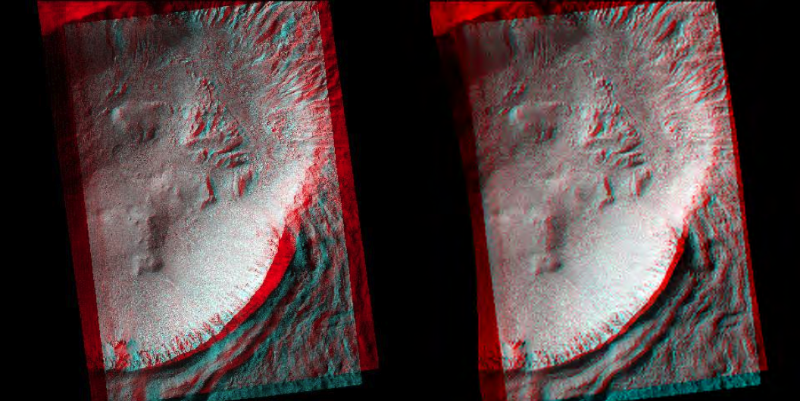
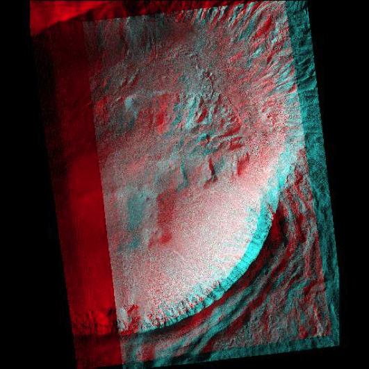
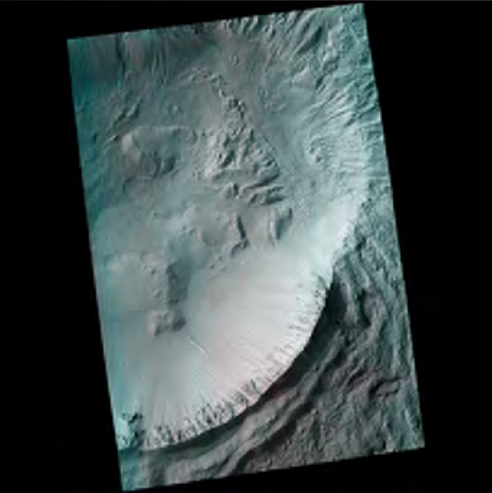
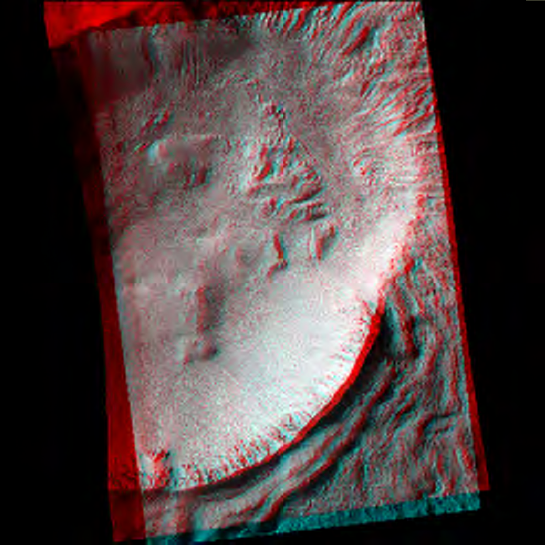
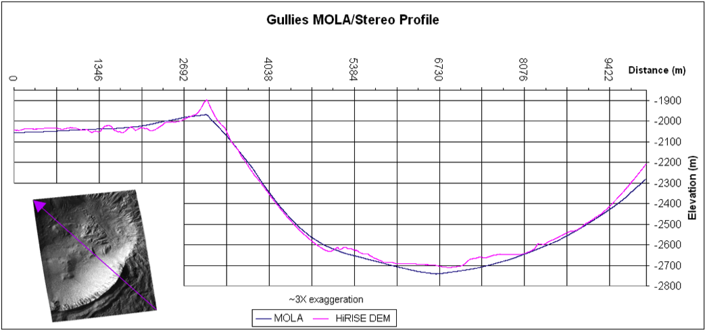

# HiRISE Anaglyphs

!!! warning "Not recommended for polar regions"
    This anaglyph procedure is recommended for lower-latitude coverage. 
    Polar region stereo coverage is more complex and has not been streamlined yet.


## Preparation - SPICE

### Overview

- Select two stereo observations
- Use RED0-9
- Begin with calibrated images
- Geometric control is an option (ccd-to-ccd)
- Run spiceinit on all RED CCD’s0-9 for both observations
    - Default to system shape model
    - Kernels Group with loaded SPICE keywords

???+ quote "Kernels Group"

    ``` 
    Group = Kernels 
      NaifIkCode = -74699
      LeapSecond = $base/kernels/lsk/naif0008.tls  
      TargetAttitudeShape = $base/kernels/pck/pck00008.tpc
      TargetPosition = Table 
      InstrumentPointing = Table
      Instrument = Null 
      SpacecraftClock = $mro/kernels/sclk/MRO_SCLKSCET.00021.65536.tsc
      InstrumentPosition = Table 
      Frame = $mro/kernels/fk/mro_v08.tf
      InstrumentAddendum = $mro/kernels/iak/hiriseAddendum003.ti 
      ShapeModel = $base/dems/molaMarsPlanetaryRadius0001.cub
    End_Group
    ```


### Run spicefit on all Red CCD’s 0-9 for both image observations

!!! example "Fit cube to InstrumentPointing parameters with [`spicefit`](https://isis.astrogeology.usgs.gov/Application/presentation/Tabbed/spicefit/spicefit.html)"
    
    Do this for each image in the observation.
    
    ```sh
    spicefit from=psp_red0.cub
    ```

### Map Template

!!! example "Make map templates and compare"

    Create a map template from both observations and compare.  The input is a list of the images in each observation.

    ```sh
    maptemplate fromlist=img1_0-9.lis map=img1.map proj=EQUIRECTANGULAR clat=0.0 clon=0.0 rngopt=CALC resop=CALC 
    maptemplate fromlist=img2_0-9.lis map=img2.map proj=EQUIRECTANGULAR clat=0.0 clon=0.0 rngopt=CALC resop=CALC 
    ```

    Evaluate the information within img1.map and img2.map.

    **Figure out the map values that will satisfy the coverage of both observations**.

    - latitude range, longitude range
    - center latitude, center longitude
    - average pixel resolution


### Local Radius

!!! example "Find the local radius values with [`campt`](https://isis.astrogeology.usgs.gov/Application/presentation/Tabbed/campt/campt.html) and [`getkey`](https://isis.astrogeology.usgs.gov/Application/presentation/Tabbed/getkey/getkey.html)"

    *The default system shape model will be referenced ([`spiceinit`](https://isis.astrogeology.usgs.gov/Application/presentation/Tabbed/spiceinit/spiceinit.html)).*

    Specify the center of each observation (`Number of Lines / 2`),  
    and get the local radius there:  
    ```sh
    campt from=psp_red5_img1.cub samp=1 line=(nlines/2) to=red5_pt1.dat 
    getkey from=red5_pt1.dat grpnname=GroundPointkeyword=LocalRadius 

    campt from=psp_red5_img2.cub samp=1 line=(nlines/2) to=red5_pt2.dat  
    getkey from=red5_pt2.dat grpname=GroundPointkeyword=LocalRadius 
    ```

!!! example "Calculate an average local radius and store it in NAIF format"

    1.  Calculate the average “local radius” value from the values found with [`campt`](https://isis.astrogeology.usgs.gov/Application/presentation/Tabbed/campt/campt.html)
    1.  Convert the average value from meters to kilometers
    1.  Build a NAIF-format text file with the average local radius (km)
    1.  *`LocalRad3391.97.tpc` contents  
        ``` 
        \begindata 
        BODY499_RADII       = ( 3391.97   3391.97 3391.97)
        ```


### Modify Labels

!!! example "Edit labels with [`editlab`](https://isis.astrogeology.usgs.gov/Application/presentation/Tabbed/editlab/editlab.html)"

    *Do this for all RED0-9 images, in both observations.*

    1.  Remove ShapeModel reference from labels
        ```sh 
        editlab from=psp_red0_img1.cub options=modkeygrpname=Kernels keyword=ShapeModel value=Null 
        ```

    1.  Add the "new" NAIF .tpcfile with the local radius to the Kernels group  
        ```sh 
        editlab from=psp_red0_img1.cub options=modkeygrpname=Kernels keyword=Instrument keyvalue= LocalRad3391.97.tpc 
        ```

    We are temporarily using an 'unused' keyword (Instrument)
    for the local radius .tpcfile; this keyword follows the main
    `TargetAttitudeShape` keyword which MUST retain reference to the
    original NAIF .tpcfile (we are mimicking a ‘search’ list for radius
    value).

???+ quote "Kernels Group with modified keywords"

    ``` 
    Group = Kernels
      NaifIkCode = -74699 
      LeapSecond = $base/kernels/lsk/naif0008.tls
      TargetAttitudeShape = $base/kernels/pck/pck00008.tpc  
      TargetPosition = Table
      InstrumentPointing = Table  
      Instrument          = LocalRad3386.70.tpc
      SpacecraftClock = $mro/kernels/sclk/MRO_SCLKSCET.00021.65536.tsc 
      InstrumentPosition = Table
      Frame               = $mro/kernels/fk/mro_v08.tf 
      InstrumentAddendum = $mro/kernels/iak/hiriseAddendum003.ti
      ShapeModel = Null 
    End_Group
    ```

-----

??? info "Gallery - Local Radius and Stereo Information"

    <div class="grid cards" markdown>

    - [](assets/Hirise_local_radius_both_high_and_low.png "Hirise_local_radius_both_high_and_low.png")  
      Local Radius retains both high and low frequency stereo data

    - [](assets/Local_Radius_bad_example.png "Local_Radius_bad_example.png")  
      The mapping results for left/right views are too far apart.  Example of bad local radius.

    - [](assets/Hirise_stereo_information_removed.png "Hirise_stereo_information_removed.png")  
      All stereo information removed

    - [](assets/Hirise_low_freq_removed_gentle_slopes.png "Hirise_low_freq_removed_gentle_slopes.png")  
      Low frequency stereo information is removed; (e.g., gentle slopes
      across the scene)

    </div>

    


## Map Projection

### Map Template

???+ quote "equi.map"

    Build a Map Template for [`cam2map`](https://isis.astrogeology.usgs.gov/Application/presentation/Tabbed/cam2map/cam2map.html). 
    Specify the Ellipsoid values for Mars Contents: 

    ``` 
    :::::::::::::: 
    equi.map
    :::::::::::::: 
    Group = Mapping
      ProjectionName = Equirectangular 
      CenterLongitude = 353.18
      CenterLatitude = 8.06 
      TargetName = mars
      EquatorialRadius = 3396190.0 <meters> 
      PolarRadius = 3376200.0 <meters>
      LatitudeType = Planetocentric 
      LongitudeDirection = PositiveEast
      LongitudeDomain = 360 
      PixelResolution = 0.28 <meters/pixel>
    End_Group 
    End
    ```


### Map Projection

!!! example "Map Project all images in both observations with [`cam2map`](https://isis.astrogeology.usgs.gov/Application/presentation/Tabbed/cam2map/cam2map.html)"

    Run [`cam2map`](https://isis.astrogeology.usgs.gov/Application/presentation/Tabbed/cam2map/cam2map.html)
    on both observations, all RED0-9 images.

    ```sh
    cam2map from=psp_red0_img1.cub map=equi.mapto=psp_red0_eq.cub pixres=map defaultrange=camera 
    ```

    **OR** Use the `-batchlist` option

    ```sh
    cam2map –batchlist=all_reds.lis from=\$1.balance.cub to=\$1.eq.cub pixres=map defaultrange=camera 
    ```

    - all_reds.lis should not include file extensions
    - Let cam2map figure out the lat/lon boundaries of each individual CCD


## Mosaics

### Create Two RED[0-9] Mosaics

!!! example "Mosaic with [`automos`](https://isis.astrogeology.usgs.gov/Application/presentation/Tabbed/automos/automos.html)"

    1.  Create a list of `cam2map` output files for each observation
    1.  Mosaic the projected Red CCDs;  
        Specify the same latitude/longitude boundaries for the output mosaics:
        ```sh
        automos fromlist=img1_eq.lis mosaic=img1_RedMos.cub grange=user minlat=  maxlat=  minlon=  maxlon= 
        automos fromlist=img2_eq.lis mosaic=img2_RedMos.cub grange=user minlat=  maxlat=  minlon=  maxlon=
        ```

!!! example "Determine the 'Left Look'"

    1.  Get the SubSpacecraft Longitudes from the `campt` output files from earlier.  
        ```sh 
        getkey from=red5_pt1.dat grpnname=GroundPointkeyword=SubSpacecraftLongitude 
        getkey from=red5_pt2.dat grpnname=GroundPointkeyword=SubSpacecraftLongitude 
        ```

    2.  The observation with the furthest west `SubspacecraftLongitude` is the "Left Look."  
        `(subspc1 < subspc2)` or `(subspc2 < subspc1)`


#### Assumptions

  - Observation pair has a longitude range within 0 –360 longitude
  - LongitudeDomain = 360
  - Neither image pair crosses the 0 and/or the 360 longitude boundary
  - [`cam2map`](https://isis.astrogeology.usgs.gov/Application/presentation/Tabbed/cam2map/cam2map.html)
    defaults to reassigning the LongitudeDomain if the image crosses a
    0/360/180 boundary


## Stack Left/Right Observations

!!! example "Stack with [`cubeit`](https://isis.astrogeology.usgs.gov/Application/presentation/Tabbed/cubeit/cubeit.html)"

    1.  Create a list of input cubes
        ``` 
        ls left_redmos_img.cub > c.lis
        ls right_redmos_img.cub >> c.lis 
        ```

    1.  Stack Cubes    
        ```sh
        cubeit list=c.lis to=anag.cub
        ```

    1.  Display anag.cub with qview  
        ``` 
        Band1 = Red
        Band2 = Green 
        Band2 = Blue
        ```

-----

<div class="grid cards" markdown>

- [:octicons-arrow-left-24: HiRISE Level 2](hirise-level-2.md)

- [HiRISE to HiRISE Geometric Control :octicons-arrow-right-24:](hirise-geometric-control.md)

</div>