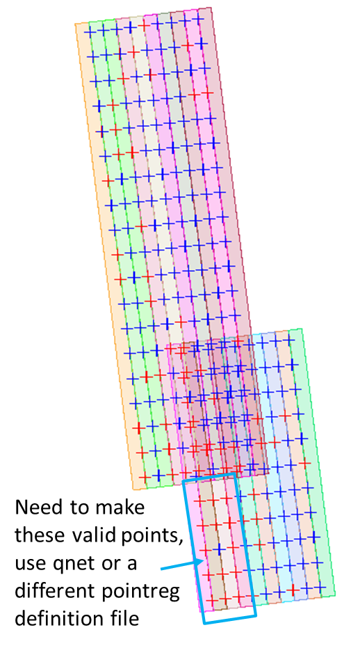
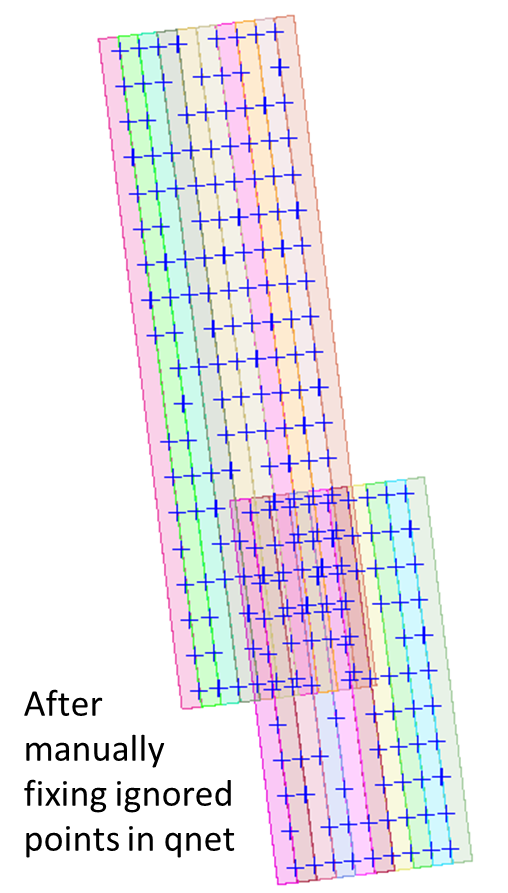
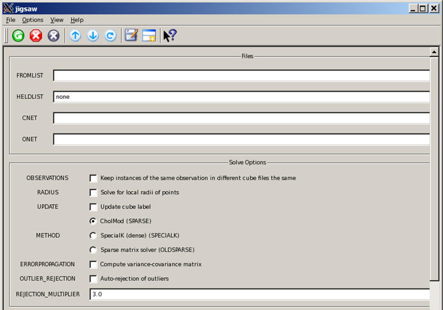
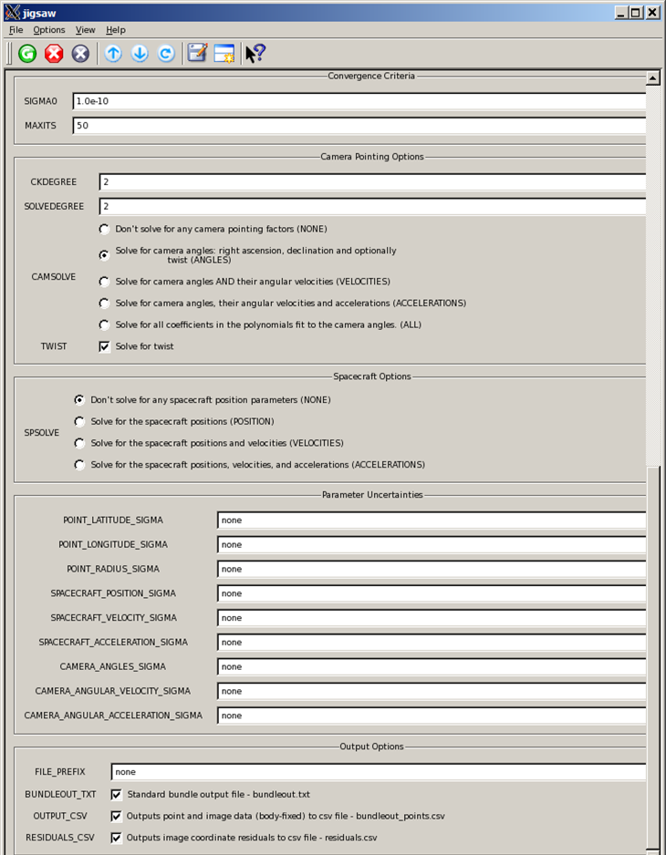
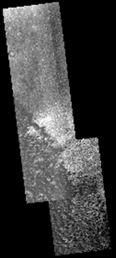

# HiRISE-to-HiRISE Geometric Control

Two HiRISE observation of red filter images will be geometrically
controlled by shifting one observation set relative to a master
observation. A collection of tiepoints that links all the images is
needed to accomplish this task. A few tiepoints will be constrained
heavily to tack down the control points when the bundle adjustment is
performed. After the camera pointing has been updated the images will be
projected, tone matched, and mosaicked together.

## Collect Tiepoints

!!! example "Collect tiepoints for each observation"

    1.  Generate normalized cube files for each observation.
        See steps under [Batch Processing](#batch-processing) above.
    
    1.  Create a list of all the normalized cube files for both observations  
        ```sh
        ls  *norm.cub > normalized.lis
        ```

    1.  Add footprint polygons to the labels of each normalized cube file ([`footprintinit`](https://isis.astrogeology.usgs.gov/Application/presentation/Tabbed/footprintinit/footprintinit.html))
        ```sh
        footprintinit from=\$1 linc=100 sinc=50 increaseprecision=true -batch=normalized.lis
        ```

    1.  Add [camera statistics](https://isis.astrogeology.usgs.gov/Application/presentation/Tabbed/camstats/camstats.html) information to the image labels of each normalized cube file  
        ```sh
        camstats from=\$1 linc=100 sinc=50 attach=true -batch=normalized.lis
        ```

    1.  Create separate lists of the normalized cubes for each observation  
        ```sh
        ls PSP_004339_1890*norm.cub > set1.lis
        ls PSP_00568*norm.cub > set2.lis
        ```

    1.  [Find image overlaps](https://isis.astrogeology.usgs.gov/Application/presentation/Tabbed/findimageoverlaps/findimageoverlaps.html) 
        and record the information to an output file for each observation separately  
        ```sh
        findimageoverlaps froml=set1.lis over=set1_overlaps.txt
        findimageoverlaps froml=set2.lis over=set2_overlaps.txt
        ```

    1.  [Automatically seed](https://isis.astrogeology.usgs.gov/Application/presentation/Tabbed/autoseed/autoseed.html) tiepoints along the overlaps.  
        ***Run separately*** to avoid seeding too many points in the overlap areas between the two sets.  
        ```sh
        autoseed fromlist=set1.lis deffile=hirise_ccd_sets_seed.def \
        overlaplist=set1_overlaps.txt onet=hirise_set_autoseed.net \
        errors=hirise_set1_autoseed.err networkid=Hirise_set1 \
        pointid=hirise_set1_\?\?\?\? \
        description="HiRise set1 images autoseed with hirise_ccd_sets_seed.def"

        autoseed fromlist=set2.lis deffile=hirise_ccd_sets_seed.def \
        overlaplist=set2_overlaps.txt onet=hirise_set_autoseed.net \
        errors=hirise_set2_autoseed.err networkid=Hirise_set2 \
        pointid=hirise_set2_\?\?\?\? \
        description="HiRise set2 images autoseed with hirise_ccd_sets_seed.def"
        ```

    1.  [Merge](https://isis.astrogeology.usgs.gov/Application/presentation/Tabbed/cnetmerge/cnetmerge.html) the two output networks produced by the autoseed program  
        ```sh
        cnetmerge inputtype=cnets base=hirise_set1_autoseed.net \
        cnet2=hirise_set2_autoseed.net onet=hirise_autoseed_merged_sets.net \
        networkid=HiRiseSets description="Hirise merge set1 and set2 networks"
        ```

    1.  Perform automatic sub-pixel [registration](https://isis.astrogeology.usgs.gov/Application/presentation/Tabbed/pointreg/pointreg.html) between the measures for each 
         control point.  A registration template is required that defines what 
         the tolerances should be for the program pointreg.  The input list 
         should contain all the images included in the two control networks that 
         were merged in the previous step.  
         ```sh
         pointreg fromlist=all_norm.lis cnet=hirise_autoseed_merged_sets.net \
         deffile=hires_p51x151_s151x251.def \
         onet=hirise_autoseed_merged_sets_ptreg.net \
         flatfile=hirise_autoseed_merged_sets_ptreg.txt points=all
         ```

<div class="grid cards" markdown>

-   [Autoseed :octicons-arrow-right-24:](../../../concepts/control-networks/autoseed.md)

-   [Pattern Matching :octicons-arrow-right-24:](../../../concepts/control-networks/automatic-registration.md)

</div>

## Evaluate the results of automatic seeding and registration

!!! example "Displaying Control Points in [`qmos`](https://isis.astrogeology.usgs.gov/Application/presentation/Tabbed/qmos/qmos.html)"

    Open the result with [`qmos`](https://isis.astrogeology.usgs.gov/Application/presentation/Tabbed/qmos/qmos.html) 
    to see the distribution of control points and their success/failure.

    ```sh
    qmos
    ```

    1. Under file, select "Open Cube List"
    2. Select the file list, and then press "Open"
    3. Click on the "Control Net" button
    4. Select the control network file (output of pointreg), and press "Open"

???+ info "Successful and Unsuccessful Tie Points in [`qmos`](https://isis.astrogeology.usgs.gov/Application/presentation/Tabbed/qmos/qmos.html)"

     Blue tie points are successful, red tie points have failed.

    <div class="grid cards" markdown>

    -   Additional work is required to convert some ignored
        tiepoints to valid tiepoints with qnet or pointreg.

        

    -   After fixing critical tiepoints that link the images together with qnet
        or pointreg. The ignored points and measures were deleted.

        

    </div>

## Control Measures - Control Net Editing and Checking

!!! example "Add and register control measures between the two observations to link them together"


    1.  [Remove all the ignored points and measures](https://isis.astrogeology.usgs.gov/Application/presentation/Tabbed/cnetedit/cnetedit.html) before adding additional 
        measures. The input network should be the output from [`qnet`](https://isis.astrogeology.usgs.gov/Application/presentation/Tabbed/qnet/qnet.html) or 
        [`pointreg`](https://isis.astrogeology.usgs.gov/Application/presentation/Tabbed/pointreg/pointreg.html) in the previous step.  
        ```sh
        cnetedit cnet=hirise_autoseed_merged_sets_ptreg.net \
        onet=hirise_autoseed_merged_sets_ptregedit.net
        ```

    1.  [Add new control measures](https://isis.astrogeology.usgs.gov/Application/presentation/Tabbed/cnetadd/cnetadd.html) 
        in order to link the two observations together.  
        ```sh
        cnetadd fromlist=all_norm.lis addlist=all_norm.lis \
        cnet=hirise_autoseed_merged_sets_ptregedit.net \
        onet=hirise_autoseed_merged_sets_ptregedit_add.net \
        log=hirise_autoseed_merged_sets_ptregedit_add.log polygon=yes
        ```

    1.  Automatically [register](https://isis.astrogeology.usgs.gov/Application/presentation/Tabbed/pointreg/pointreg.html) 
        the new measures to the reference measures 
        which were set in the previous steps.  The registration template
        must be modified to allow for the offset between the two sets.
        In most cases, the search area needs to be increased and some of
        the other settings may need to be adjusted also.  

        IMPORTANT: set "measures=candidates"  
        ```sh
        pointreg fromlist=all_norm.lis points=all measures=candidates \
        cnet=hirise_autoseed_merged_sets_ptregedit_add.net \
        deffile=hirise_p151x501_s651x1501.def \
        onet=hirise_autoseed_merged_sets_ptregedit_addptreg1.net \
        flatfile=hirise_autoseed_merged_sets_ptregedit_addptreg1.txt
        ```

    1.  [Remove all ignored measures](https://isis.astrogeology.usgs.gov/Application/presentation/Tabbed/cnetedit/cnetedit.html) from the control network.  
        ```sh
        cnetedit cnet=hirise_autoseed_merged_sets_ptregedit_addptreg1.net \
        onet=hirise_autoseed_merged_sets_ptregedit_addptreg1edit.net
        ```

    1.  [Check](https://isis.astrogeology.usgs.gov/Application/presentation/Tabbed/cnetcheck/cnetcheck.html) the network for missing links, single measures, no control 
        points, or problems with the latitude and longitude.  
        ```sh
        cnetcheck fromlist=all_norm.lis prefix=cknet1_ \
        cnet=hirise_autoseed_merged_sets_ptregedit_addptreg1edit.net
        ```

    1.  Check the output results and fix any problems reported. 
        If the network is good, continue to the next step.


<div class="grid cards" markdown>

-   [Automatic Registration :octicons-arrow-right-24:](../../../concepts/control-networks/automatic-registration.md)

</div>


## Use `qnet` to constrain tiepoints

We will be adjusting all the images relative to one image instead of to
actual ground coordinates. Use the interactive program
[`qnet`](https://isis.astrogeology.usgs.gov/Application/presentation/Tabbed/qnet/qnet.html)
to constrain a set of tiepoints to a specified geographic location. The
amount of movement allowed will be defined by setting the apriori
latitude, longitude, and radius values by some amount. In our example,
the apriori sigma values for (lat, lon, radius) will be set to (1.0,
1.0, and 100.0) for the selected tiepoints. Make sure the latitude,
longitude values are obtained from the same image.

<div class="grid cards" markdown>

-   [`qnet` ISIS App Docs :octicons-arrow-right-24:](http://isis.astrogeology.usgs.gov/Application/presentation/Tabbed/qnet/qnet.html)

</div>

!!! example "Open cubes and control networks in [`qnet`](http://isis.astrogeology.usgs.gov/Application/presentation/Tabbed/qnet/qnet.html)"

    1. Open [`qnet`](http://isis.astrogeology.usgs.gov/Application/presentation/Tabbed/qnet/qnet.html)

    1. Select "Open control network cube list"
    1. Select "all_norm.lis"
    1. Select "hirise_autoseed_merged_sets_ptregedit_addptreg1edit.net"

    1. In the "Control Network Navigator" window go to the drop-down menu 
       next to "Points", and select "Cubes"

    1. Select both "RED5" cubes, ''hold down "Ctrl" button while selecting the 
       files (PSP_004339_1890_RED5_norm.cub and PSP_005684_1890_RED5_norm.cub)

    1. Click on "View Cubes" button 

    The two images should be displayed in the qnet window.

!!! info "[`qnet`](http://isis.astrogeology.usgs.gov/Application/presentation/Tabbed/qnet/qnet.html) Tie Point Colors"

    - Green: Valid Control Point
    - Magenta: Constrained Point
    - Yellow: Ignored points

!!! example "Selecting points to constrain"

    Select 3 points, one at top, center, and bottom 
    of the same image to constrain the latitude and longitude coordinates. 
    
    - Do not use yellow (ignored) points to constrain control points!

    - Make sure the left image in the "Qnet Tool" or editor window 
      has the "RED5" image displayed on the left. 

!!! example "Locating and Opening a DEM"

    A DEM is required in order to constrain the points; the file must have been run through
    [`demprep`](https://isis.astrogeology.usgs.gov/Application/presentation/Tabbed/demprep/demprep.html).

    Find the location where the DEM is stored. 
    The dems are normally stored in $ISIS3DATA/base/dems directory.

    1.  Go to "File" and select "Open ground source".  
        Select "$base/dems/molaMarsPlanetaryRadius0005.cub"

    1.  Go to "File" and select "Open radius source".  
        Select "$base/dems/molaMarsPlanetaryRadius0005.cub"

!!! example "Constraining a Control Point"

    1. In the qnet window, select the "Control point editor" button  
       (the last button with two arrow points)

    1. Click on the uppermost green crosshair in the qnet window for one of 
       the RED5 images.  The point will be displayed in the editor window.

    1. Next, Select "Points" in the control network navigator window

    1. In the editor window:
        1. Select "Constrained" using the drop-down menu next to "Free"
        1. Click "Save Measure" in the editor window
        1. Click "Save Point" in the editor window
        1. Click "Floppy disk icon" to save the changes to the file  
           (Do not skip this step!)

    5. In the control navigator window:
        1. Click "Set Apriori/Sigmas"
        1. Enter Latitude Sigma=1.0 Longitude Sigma=1.0, and Radius Sigma=100.0
        1. Click "Set Apriori"
        1. Click "Save network" Point should change color from green to magenta


REPEAT the "Constraining a Control Point" STEPS for center and bottom points.  

Save the control network file.

## Bundle adjustment

After constraining at least 3 tiepoints, run the bundle adjustment program
[`jigsaw`](https://isis.astrogeology.usgs.gov/Application/presentation/Tabbed/jigsaw/jigsaw.html). 

*Do not check "update" and "error propagation" until an acceptable solution is reached*. 

After each run, check the output file showing the
residuals to determine if there are bad measures in the control network.

??? note "`jigsaw` GUI with parameter names"

    

    

Our settings are very basic since our primary purpose is to shift one
observation to match another, and we are not actually including accurate
ground points. For advanced users, the steps and parameters used may be
adjusted to fit your particular needs.

!!! example "Bundle Adjustment with [`jigsaw`](https://isis.astrogeology.usgs.gov/Application/presentation/Tabbed/jigsaw/jigsaw.html)"

    ```sh
    jigsaw fromlist=all_norm.lis onet=jigtest1.net \
    cnet=hirise_autoseed_merged_sets_ptregedit_addptreg1edit.net \
    radius=yes sigma0=1.0e-6 maxits=10 point_radius_sigma=1000 \
    camera_angles_sigma=3 file_prefix=jig1
    ```
    
    Check the output files:
    ```sh
    sort -k8,8nr jig1_residuals.csv|more
    ```

    - The residuals should be less than 5 pixels, check large residuals 
      using qnet, or create a list of pointid's and delete with cnetedit
    
    ```sh
    egrep -a cub jig1_bundleout.txt |more
    ```

    - The last 3 columns next to the filenames should be small
    
    Final run:
    ```sh
    jigsaw fromlist=all_norm.lis onet=jigtest1.net update=yes \
    cnet=hirise_autoseed_merged_sets_ptregedit_addptreg1edit.net \
    radius=yes sigma0=1.0e-6 maxits=10 point_radius_sigma=1000 \
    camera_angles_sigma=3 file_prefix=jig1 errorpro=yes
    ```

<div class="grid cards" markdown>

-   [`jigsaw` Demo Slides :octicons-arrow-right-24:](../../../assets/isis-demos/Jigsaw.pdf)

-   [`jigsaw` ISIS App Docs :octicons-arrow-right-24:](http://isis.astrogeology.usgs.gov/Application/presentation/Tabbed/jigsaw/jigsaw.html)

</div>


## Map projection and mosaic

The final step is to project the images, tone match the set, and mosaic
the files together. A map template is needed in order to project the
images. Our map template contains the following parameter settings:

???+ quote "mars_equi.map"

    ```sh
    Group = Mapping
       TargetName         = Mars
       ProjectionName     = Equirectangular
       CenterLongitude    = 0.0
       CenterLatitude     = 0.0
       #EquatorialRadius   = 3396190.0 <meters>
       #PolarRadius        = 3376200.0 <meters>
       LatitudeType       = Planetocentric
       LongitudeDirection = PositiveEast
       LongitudeDomain    = 180
       PixelResolution    = .5 <meters/pixel>
    End_Group
    ```

!!! example "Map Project Images with [`cam2map`](https://isis.astrogeology.usgs.gov/Application/presentation/Tabbed/cam2map/cam2map.html) (Level1 → Level2)"

    ```sh
    ls *norm.cub > lev1.lis
    cam2map from=\$1 to=lev2_\$1 map=mars_equi.map -batch=lev1.lis
    ```

!!! example "Tone match images with [`equalizer`](https://isis.astrogeology.usgs.gov/Application/presentation/Tabbed/equalizer/equalizer.html)"

    ```sh
    ls lev2_*norm.cub > lev2.lis
    ls lev2_PSP_004339_1890_RED5_norm.cub > hold.lis
    equalizer fromlist=lev2.lis holdlist=hold.lis outstats=stats.txt
    ```

!!! example "Mosaic images with [`automos`](https://isis.astrogeology.usgs.gov/Application/presentation/Tabbed/automos/automos.html)"

    ```sh
    ls lev2*equ.cub > lev2equ.lis
    automos froml=lev2equi.lis mosaic=hirise_set_mosaic.cub
    ```

Final mosaic of two observations:




## ISIS Apps Used in HiRISE to HiRISE Geometric Control

  - [`footprintinit`](https://isis.astrogeology.usgs.gov/Application/presentation/Tabbed/footprintinit/footprintinit.html)
    : Add footprint polygons to image labels
  - [`camstats`](https://isis.astrogeology.usgs.gov/Application/presentation/Tabbed/camstats/camstats.html)
    : Add camera statistics to image labels
  - [`findimageoverlaps`](https://isis.astrogeology.usgs.gov/Application/presentation/Tabbed/findimageoverlaps/findimageoverlaps.html)
    : Find overlaps between a set of images
  - [`autoseed`](https://isis.astrogeology.usgs.gov/Application/presentation/Tabbed/autoseed/autoseed.html)
    : Automatically create a network file by seeding tiepoints
  - [`cnetmerge`](https://isis.astrogeology.usgs.gov/Application/presentation/Tabbed/cnetmerge/cnetmerge.html)
    : Merge different control network files
  - [`pointreg`](https://isis.astrogeology.usgs.gov/Application/presentation/Tabbed/pointreg/pointreg.html)
    : Sub-pixel register control measures for a control point
  - [`qmos`](https://isis.astrogeology.usgs.gov/Application/presentation/Tabbed/qmos/qmos.html)
    : Display image footprints and control point networks
  - [`qnet`](https://isis.astrogeology.usgs.gov/Application/presentation/Tabbed/qnet/qnet.html)
    : Interactive program to collect and modify control measures and
    ground points
  - [`cnetedit`](https://isis.astrogeology.usgs.gov/Application/presentation/Tabbed/cnetedit/cnetedit.html)
    : Delete control points and measures from a control network
  - [`cnetadd`](https://isis.astrogeology.usgs.gov/Application/presentation/Tabbed/cnetadd/cnetadd.html)
    : Add control measures to an existing control network
  - [`cnetcheck`](https://isis.astrogeology.usgs.gov/Application/presentation/Tabbed/cnetcheck/cnetcheck.html)
    : Check control network file before running jigsaw
  - [`jigsaw`](https://isis.astrogeology.usgs.gov/Application/presentation/Tabbed/jigsaw/jigsaw.html)
    : Bundle adjustment program to update camera pointing information
  - [`cam2map`](https://isis.astrogeology.usgs.gov/Application/presentation/Tabbed/cam2map/cam2map.html)
    : Map project level 1 images
  - [`equalizer`](https://isis.astrogeology.usgs.gov/Application/presentation/Tabbed/equalizer/equalizer.html)
    : Tone match a set of images
  - [`automos`](https://isis.astrogeology.usgs.gov/Application/presentation/Tabbed/automos/automos.html)
    : Create a mosaic

-----

<div class="grid cards" markdown>

- [:octicons-arrow-left-24: HiRISE Anaglyphs](hirise-anaglyphs.md)

- [HiRISE Overview :octicons-arrow-right-24:](hirise/index.md)

</div>