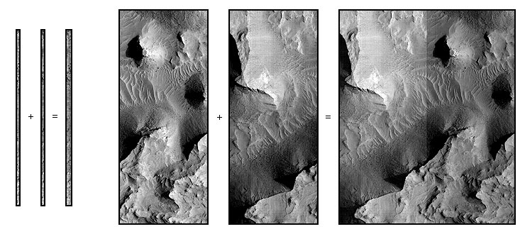
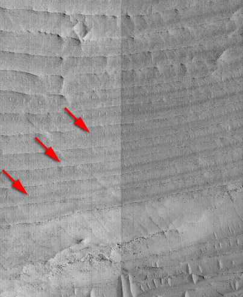
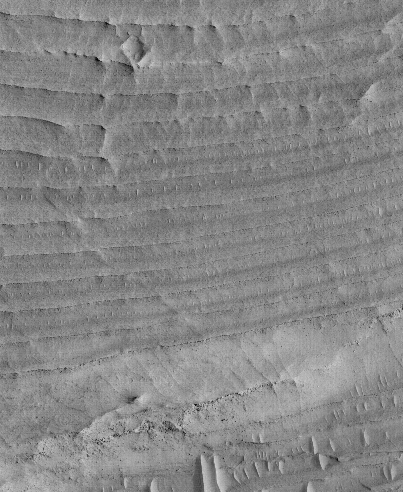

# Level1 HiRISE

## HiRISE Radiometric Calibration

??? info "About HiRISE Radiometric Calibration"

    A radiometric calibration product is representative of an ideal image
    acquired by a camera system with perfect radiometric properties. Values
    in the resulting image represent the reflectance of the surface (I/F).

    The radiometric calibration of HiRISE images has been a challenging work
    in progress. The camera has 14 CCDs with separate readouts, and many
    different operating modes such as pixel binning and time delay
    integration. Understanding and solving the radiometric calibration for
    HiRISE is like solving for 28 individual cameras. The HiRISE Science
    Team is continually working on the calibration of their instrument, and
    updates to ISIS will be made over time as the calibration
    sequence matures.

    See Also: [General Overview of Radiometric Calibration :octicons-arrow-right-24:](../../../concepts/image-processing/overview-of-radiometric-calibration.md)

-----

!!! example "Radiometrically calibrating a single HiRise image with [`hical`](http://isis.astrogeology.usgs.gov/Application/presentation/Tabbed/hical/hical.html)"

    ```sh
    hical from=PSP_002733_1880_RED5_0.cub to=PSP_002733_1880_RED5_0.cal.cub
    ```

    See [`hical` ISIS App Documentation](http://isis.astrogeology.usgs.gov/Application/presentation/Tabbed/hical/hical.html) for more info.

-----

!!! note "Do it again!"

    Run `hical` on each ISIS cube in the observation.


## Channel Stitching

-----

A special requirement for HiRISE is the reconstruction of the CCD data.
That is, merging the left and right channel data from an individual CCD
into a single image.

HiRISE reads the data from one CCD into two separate channels. 
The next step in level 1 processing is to combine the
two channel cubes back into an individual CCD image.

!!! example "Merge two channels with [`histitch`](http://isis.astrogeology.usgs.gov/Application/presentation/Tabbed/histitch/histitch.html)"

    ```sh
        histitch from1=PSP_00273_1880_RED5_0.cal.cub from2=PSP_00273_1880_RED5_1.cal.cub \
                 to=PSP_00273_1880_RED5.cal.cub
    ```

    The left and right channels (`0` and `1`) are stitched together to form a single `RED5` CCD image.


???+ note "`histitch` illustration"

    

    Left three images: Data from channels 0 (left) and 1 (center) 
    of a red 5 image stitched together to create the full red 5 
    CCD image (right). The images shown here are scaled-down full 
    HiRISE channel images.
    
    Right three images: Close-up on a portion of the images shown 
    on the left. Data from channels 0 (left) and 1 (center) of a 
    red 5 image stitched together to create the full red 5 CCD 
    image (right). Note that in the final image, the data from 
    channel 0 appears on the right, and the data channel 1 appears
    on the left.


## Noise Removal

For HiRISE, systematic noise appears as vertical striping, referred to
as furrows, which occur under certain observing conditions, and tonal
mismatches among the data sets collected by adjacent channels in a CCD.

<div class="grid cards" markdown>

- See Also: [General Overview of Noise and Artifacts :octicons-arrow-right-24:](../../../concepts/image-processing/overview-of-noise-and-artifacts.md)

</div>

### Vertical Striping and Channel Tone Differences

!!! info "This step may be removed in the future as the radiometric calibration matures."

The current radiometric calibration of the HiRISE data may reveal
vertical striping noise in the CCD images. This is especially true for
data collected by CCDs which have shown degradation in data collected
over time (like RED9).

Tone differences caused by the
the electronic read-out of the left/right channels may not be fully
corrected by the calibration program.

[`cubenorm`](http://isis.astrogeology.usgs.gov/Application/presentation/Tabbed/cubenorm/cubenorm.html), 
which normalizes values in an image, can be used to remove both the striping and left/right normalization problems.

!!! example "Removing noise and tone mismatch with [`cubenorm`](http://isis.astrogeology.usgs.gov/Application/presentation/Tabbed/cubenorm/cubenorm.html)"

    ```sh
    cubenorm from=PSP_002733_1880_RED5.cal.cub to=PSP_002733_1880_RED5.cal.norm.cub
    ```

???+ note "`cubenorm` illustration"

    <div class="grid cards" markdown>

    -   [](assets/Cubenorm_Before.png "Cubenorm_Before.png")

        **Before cubenorm**: Vertical striping (red arrows) and left/right channel tone problem.

    -   [](assets/Cubenorm_After.png "Cubenorm_After.png")

        **After cubenorm**: Vertical striping and tone problem removed.

    </div>

-----

<div class="grid cards" markdown>

- [:octicons-arrow-left-24: HiRISE Level 0](hirise-level-0.md)

- [HiRISE Level 2 :octicons-arrow-right-24:](hirise-level-2.md)

</div>
