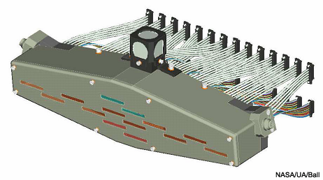
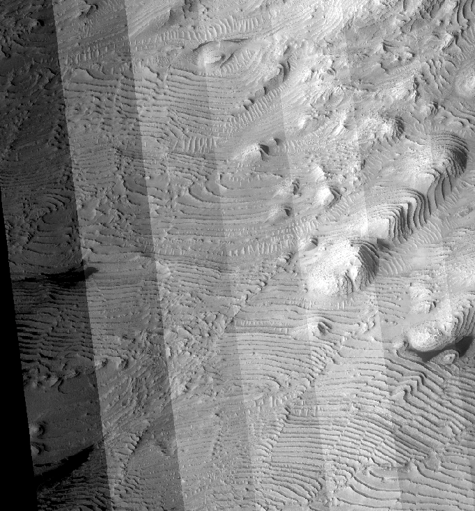
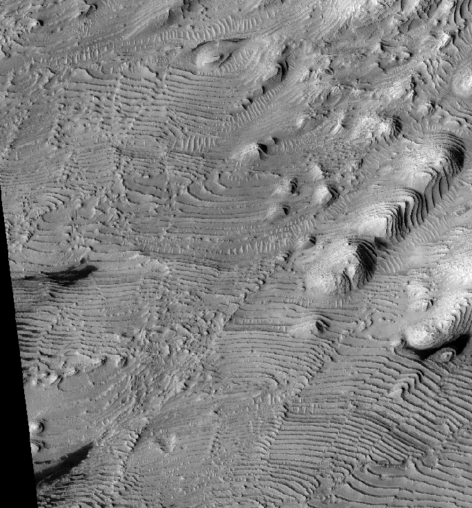

# Level2 HiRISE

!!! note "Prerequisites - [HiRISE Level 1](hirise-level-1.md) Processed Images"

    - Up to 14 CCD images
        - Imported into ISIS with `hi2isis`
        - `spiceinit` applied to each
        - Radiometrically Calibrated with `hical`
        - Noise Removed

!!! info inline end "HiRISE Focal Plane Assembly - Illustration"

    [](assets/Focalplaneassembly.png "Focalplaneassembly.png")

    Each CCD has 2048px in the cross scan direction. 
    The 14 staggered CCDs overlap by 48px at each end. 
    This gives a total width of ~20,000px for RED and 4,048px 
    for the BG and IR images.

When the camera electronics read out the image data, 
each CCD is broken in two halves (left and right channels). 
On the ground, the data for one observation is up stored 
in 28 image files (14 CCDs with 2 channels each). 
A Level2 ISIS cube combines these CCD images into a single mosaic.

The Level2 process involves the following:

1. **Geometric transformation** of each CCD image from spacecraft
    camera orientation to a common map coordinate system
1. **Correction of tonal mismatches** among the projected images (optional)
1. **Creation of a HiRISE observation mosaic** of the tone matched CCD
    images to create a complete HiRISE observation image.

The results of this process will be an ***uncontrolled observation mosaic***,
meaning that the output map will only be as accurate as the original
SPICE allows. Software and procedures for creating controlled (adjusted
SPICE) mosaics are underway. Information and documentation will be
released on our site.


<div class="grid cards" markdown>

- [All About Map Projections in ISIS :octicons-arrow-right-24:](../../../concepts/camera-geometry-and-projections/learning-about-map-projections.md)

- [Map Projecting with `maptemplate` and `cam2map` :octicons-arrow-right-24:](../../../how-to-guides/image-processing/map-projecting-images.md)

</div>


## Map Projecting HiRISE Images

To assemble the HiRISE observation mosaic from the CCD images, use 
[`cam2map`](http://isis.astrogeology.usgs.gov/Application/presentation/Tabbed/cam2map/cam2map.html)
to convert each CCD image to a map projected image. 
This example projects one image first, then uses the same projection for the others.
Alternatively, [`maptemplate`](https://isis.astrogeology.usgs.gov/Application/presentation/Tabbed/maptemplate/maptemplate.html)
can create custom map files.

!!! example "Part A: Project 1st image with [`cam2map`](http://isis.astrogeology.usgs.gov/Application/presentation/Tabbed/cam2map/cam2map.html)"
    
    **RED5 is a good choice to project first**. It's near the center of the observation.

    ```sh
    cam2map from=PSP_002733_1880_RED5.norm.cub to=PSP_002733_1880_RED5.sinu.cub
    ```

    The output cube has the mapping parameters needed to
    project the other images, so they can be mosaicked.

    The default projection for `cam2map` is sinusoidal, 
    so the resulting RED5 image is now in sinusoidal projection.

!!! example "Part B: Project the rest of the images with [`cam2map`](http://isis.astrogeology.usgs.gov/Application/presentation/Tabbed/cam2map/cam2map.html)"

    ```sh
    cam2map from=PSP_002733_1880_?.norm.cub \
            to=PSP_002733_1880_?.sinu.cub \
            map=PSP_002733_1880_RED5.sinu.cub pixres=map
    ```

    The **RED5 sinusoidal cube** is used as the map file. 
    The remaining CCD images will use the same projection parameters as RED5. 
    When mosaicking, all input images for the mosaic must have the same projection parameters.


<div class="grid cards" markdown>

- [`maptemplate` ISIS App Docs :octicons-arrow-right-24:](https://isis.astrogeology.usgs.gov/Application/presentation/Tabbed/maptemplate/maptemplate.html) 

    Creates a map file that can be used to project images

- [`cam2map` ISIS App Docs :octicons-arrow-right-24:](http://isis.astrogeology.usgs.gov/Application/presentation/Tabbed/cam2map/cam2map.html)

    Geometrically transforms a raw camera image to a map projected image

</div>


## Tone Matching

!!! example "Tone-match images with [`equalizer`](https://isis.astrogeology.usgs.gov/Application/presentation/Tabbed/equalizer/equalizer.html)"

    1.  **Hold** the tone of the RED5 CCD image.  
        The pixel values in RED5 won't be changed. 
        RED0-4 and RED6-9 will be normalized to RED5's tone. 
        Make a list the filename(s) that will be held.
        ```sh
        ls *RED5.cub > hold.lis
        ```

    1.  **List all images to be normalized.**  
        Their contrast/brightness will be updated so that tones match the
        RED5 image on the hold list. This will normalize to the RED calibration. 
        [`equalizer`](https://isis.astrogeology.usgs.gov/Application/presentation/Tabbed/equalizer/equalizer.html) 
        analyzes the pixels in the overlap regions to calculate its corrections.  
        ```sh
        ls *RED*.cub > redCCD.lis
        ```

    1.  Run
        [`equalizer`](https://isis.astrogeology.usgs.gov/Application/presentation/Tabbed/equalizer/equalizer.html)
        with the two lists created above as input.   
        ```sh
        equalizer fromlist=redCCD.lis holdlist=hold.lis
        ```

    The output should be ten cubes (RED0-9) with `.equ.cub` extension. 

<div class="grid cards" markdown>

-   [](assets/Tone_Matching_Without_EQ.png "Tone_Matching_Without_EQ.png")

    **No** equalization.

-   [](assets/Tone_Matching_With_EQ.png "Tone_Matching_With_EQ.png")

    **Equalized**.

</div>

## Mosaicking

!!! example "Constructing a Mosaic with [`automos`](https://isis.astrogeology.usgs.gov/Application/presentation/Tabbed/automos/automos.html)"

    A new list of the equalized cube filenames is required as input.

    ```sh
    ls *RED*.equ.cub > mosaic.lis
    automos fromlist=mosaic.lis to=redMosaic.cub
    ```

!!! warning ""

    Only add filenames for one observation (or adjacent observations) 
    to the list file, otherwise *all* the images in the list 
    will be mosaicked into a single output image.

-----

*The example created a mosaic with RED images.  
Near-infrared (IR) and blue-green (BG) images follow a similar process.*

-----

<div class="grid cards" markdown>

- [:octicons-arrow-left-24: HiRISE Level 1](hirise-level-1.md)

- [HiRISE Anaglyphs :octicons-arrow-right-24:](hirise-anaglyphs.md)

</div>
