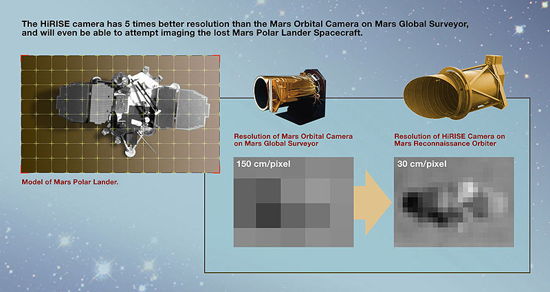
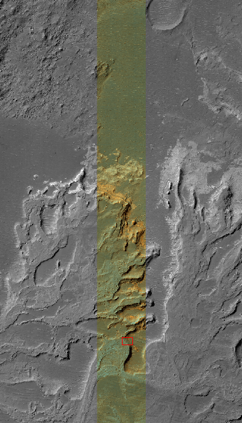
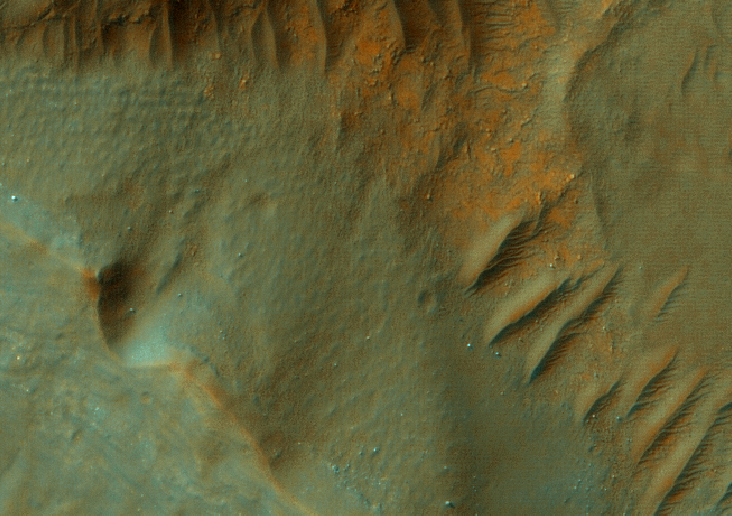

# Working with MRO HiRISE Data

<div class="grid cards" markdown>

- [:octicons-arrow-left-24: The MRO Mission](../index.md)

</div>

### Instrument Overview

!!! quote inline end ""

    [](../assets/MRO_HiRISE.jpg "MRO_HiRISE.jpg")

    A comparison between the resolution of a camera aboard
    Mars Global Surveyor and the HiRISE camera on 
    Mars Reconnaissance Orbiter. *NASA/JPL*

HiRISE has acquired more than 20,000 images of the martian surface in
unprecedented detail.

HiRISE operates in visible wavelengths with a telescope that will
produce images at resolutions never before possible in planetary
exploration. These high resolution images will enable scientists to
resolve 1-meter (about 3-foot) sized objects on Mars and to study the
morphology (surface structure) in a much more comprehensive manner than
ever before.

From an altitude of approximately 300 kilometers above Mars, HiRISE will
return surface images comprised of pixels representing 30 centimeters of
the martian surface.

These high-resolution images provide unprecedented views of layered
materials, gullies, channels, and other science targets, as well as
possible future landing sites.


### Technical Details

!!! quote inline end ""

    [](../assets/HiRISE_Sample_Observation.png "HiRISE_Sample_Observation.png")

    This image is one half (vertically) of a HiRISE observation
    scaled down to approximately 1/50th of its original resolution.
    It is of a small area inside Eberswalde crater in
    Margaritifer Sinus. Taken on November 8, 2006, the image is a 
    composite of all 10 red detectors and the 2 blue-green detectors.  Notice, the blue-green detectors only cover the middle.

This telescopic camera has a primary mirror diameter of 50 centimeters
and a field of view of 1.15°. At its focal plane, the instrument holds
an array of 14 electronic detectors, each covered by a filter in one of
three wavelength bands: 400 to 600 nanometers (blue-green), 550 to 850
nanometers (red), or 800 to 1000 nanometers (near-infrared). Ten red
detectors are positioned in a line totaling 20,028 pixels across to
cover the whole width of the field of view. Typical red images are
20,000 pixels wide by 40,000 lines high. Two each of the blue-green and
near-infrared detectors lie across the central 20% of the field. Pixel
size in images taken from an altitude of 300 kilometers will be 30
centimeters across, about a factor of two better than the
highest-resolution down-track imaging possible from any earlier Mars
orbiter and a factor of five better than any extended imaging to date.
Generally, at least three pixels are needed to show the shape of a
feature, so the smallest resolvable features in the images will be about
a meter across for an object with reasonable contrast to its
surroundings. The instrument uses a technology called time delay
integration to accomplish a high signal-to-noise ratio for unprecedented
image quality.

The Principal Investigator (lead scientist) for HiRISE is Alfred McEwen
from the [Lunar and Planetary Laboratory](http://www.lpl.arizona.edu/)
at the [University of Arizona](http://www.arizona.edu/) .

!!! quote inline end ""

    [](../assets/HiRISE_Sample_Full_Resolution_Subarea.png "HiRISE_Sample_Full_Resolution_Subarea.png")

    A sub-area of the above observation (indicated by the red outline). 
    One pixel represents 25.6 cm on the surface of Mars.

### References & Related Resources

TODO: Check links

  - [HiRISE instrument description](http://mars.jpl.nasa.gov/mro/mission/instruments/hirise/)
  - [HiRISE instrument technical description](http://marsoweb.nas.nasa.gov/HiRISE/papers/6th_mars_conf/Delemere_HiRISE_InstDev.pdf)
    (PDF)
  - [HiRISE mission web site](http://marsoweb.nas.nasa.gov/HiRISE/)
  - [en.wikipedia.org/wiki/HiRISE](http://en.wikipedia.org/wiki/HiRISE)
  - [Mars Reconnaissance Orbiter mission web site](http://mars.jpl.nasa.gov/mro/)


## Cartographic Processing HiRISE Data

### **[Level 0 Processing](../hirise-level-0.md)**

1.  [Data Acquisition](../hirise-level-0.md)
1.  [Ingestion](../hirise-level-0.md)
1.  [SPICE](../hirise-level-0.md)
1.  [Raw Camera Geometry](../hirise-level-0.md)

### **[Level 1 Processing](../hirise-level-1.md)**

1.  [Radiometric Calibration](../hirise-level-1.md)
1.  [Channel Stitching](../hirise-level-1.md)
1.  [Noise Removal](../hirise-level-1.md)

### **[Level 2 Processing](../hirise-level-2.md)**

1.  [Map Projection](../hirise-level-2.md)
1.  [Tone Match](../hirise-level-2.md)
1.  [Mosaic](../hirise-level-2.md)


## HiRISE Guides

<div class="grid cards" markdown>

-   [HiRISE Anaglyphs :octicons-arrow-right-24:](../hirise-anaglyphs.md)

-   [HiRISE to HiRISE Geometric Control :octicons-arrow-right-24:](../hirise-to-hirise-geometric-control.md)

</div>


## Batch Processing

The ingestion, SPICE initialization, calibration, merging, and
normalization must be run for each channel image. This would be
incredibly tedious to run each application for every file! Luckily,
batch processing is easy in ISIS. Using the 
[-batchlist command line option](../../../../concepts/isis-fundamentals/command-line-usage.md#-batchlist-parameter), 
a set of CCD images for a single observation can be
processed swiftly through level 1 processing.

???+ note "Running ISIS Apps with the `-batchlist` option"

    1.  Create a single column list of images without the file extension  
        ```sh
        ls *.IMG | sed s/.IMG// > cube.lis
        ```

    1.  Run [`hi2isis`](https://isis.astrogeology.usgs.gov/Application/presentation/Tabbed/hi2isis/hi2isis.html) on the list of files, adding the input/output extensions 
        in the command line  
        ```sh
        hi2isis from=\$1.IMG to=\$1.cub -batchlist=cube.lis
        ```

    1.  Apply [`spiceinit`](http://isis.astrogeology.usgs.gov/Application/presentation/Tabbed/spiceinit/spiceinit.html) 
        to the [`hi2isis`](https://isis.astrogeology.usgs.gov/Application/presentation/Tabbed/hi2isis/hi2isis.html) output cube files  
        ```sh
        spiceinit from=\$1.cub -batchlist=cube.lis
        ```

    1.  Apply [`hical`](http://isis.astrogeology.usgs.gov/Application/presentation/Tabbed/hical/hical.html) with the appropriate input/output file extensions  
        ```sh
        hical from=\$1.cub to=\$1.cal.cub -batchlist=cube.lis
        ```

    1.  Create a list of one of the channels without file extensions  
        ```sh
        ls *_0.IMG | sed s/_0.IMG// > cube2.lis
        ```

    1.  Stitch together the channels in [`histitch`](http://isis.astrogeology.usgs.gov/Application/presentation/Tabbed/histitch/histitch.html) specifying each appropriate extension 
        in the command line  
        ```sh
        histitch from1=\$1_0 from2=\$1_1 to=\$1 -batchlist=cube2.lis
        ```

    1.  Normalize, tone-match across the channels (if necessary) in [`cubenorm`](http://isis.astrogeology.usgs.gov/Application/presentation/Tabbed/cubenorm/cubenorm.html)  
        ```sh
        cubenorm from=\$1 to=\$1.norm.cub -batch=cube2.lis
        ```

    -----

    ISIS Apps Used:

    -   [`hi2isis`](https://isis.astrogeology.usgs.gov/Application/presentation/Tabbed/hi2isis/hi2isis.html) - 
        Converts a HiRISE EDR to ISIS3 cube format

    -   [`spiceinit`](http://isis.astrogeology.usgs.gov/Application/presentation/Tabbed/spiceinit/spiceinit.html) - 
        Adds SPICE information to the input cube

    -   [`hical`](http://isis.astrogeology.usgs.gov/Application/presentation/Tabbed/hical/hical.html) - 
        Radiometrically calibrates HiRISE channel images

    -   [`histitch`](http://isis.astrogeology.usgs.gov/Application/presentation/Tabbed/histitch/histitch.html) - 
        Combines two HiRISE channel images to form a single CCD image

    -   [`cubenorm`](http://isis.astrogeology.usgs.gov/Application/presentation/Tabbed/cubenorm/cubenorm.html) - 
        Normalizes values in a image


## Exporting ISIS Data

!!! warning "Exporting large HiRISE images"

    HiRISE mosaics are very large and our export application
    [`isis2std`](http://isis.astrogeology.usgs.gov/Application/presentation/Tabbed/isis2std/isis2std.html)
    does not handle large PNG or JPEG images. You will need to decrease the
    size of the image to export by either cropping or reducing.

<div class="grid cards" markdown>

-   [`reduce` ISIS App Docs](https://isis.astrogeology.usgs.gov/Application/presentation/Tabbed/reduce/reduce.html)  
    Scale down a cube

-   [`crop` ISIS App Docs](https://isis.astrogeology.usgs.gov/Application/presentation/Tabbed/crop/crop.html)  
    Pull a region out of a cube

-   [Exporting ISIS Data :octicons-arrow-right-24:](../../../../getting-started/using-isis-first-steps/exporting-isis-data.md)

</div>
