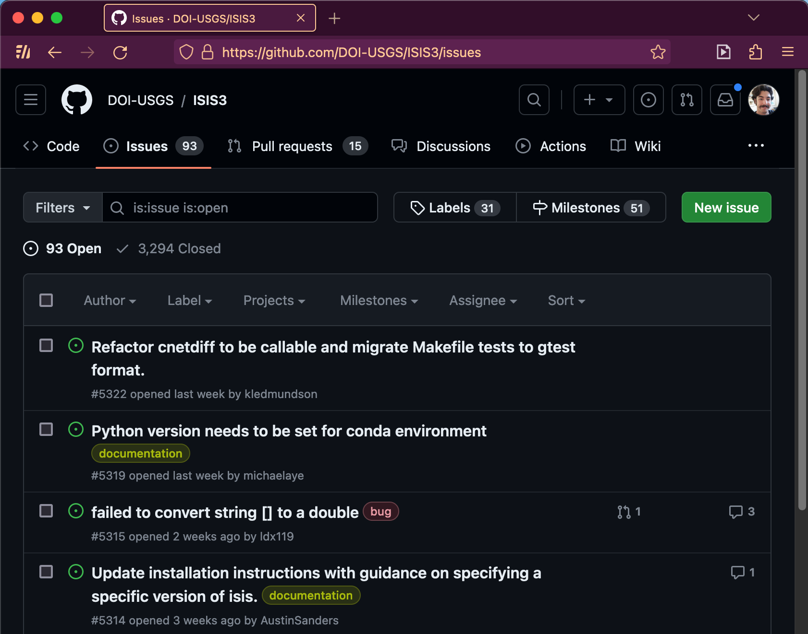
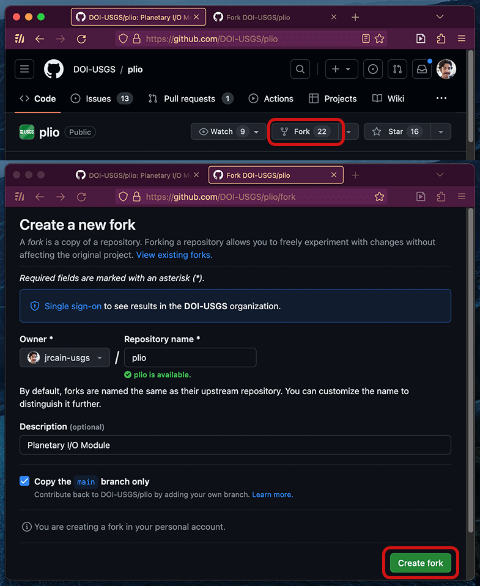

# Contributing with Git and GitHub

Community contributions are an important part of USGS open source projects.
Contributions from people like you help make our projects at the USGS better for everyone.
And, by contributing, you can build your skills, display your work, and form community connections.

USGS Astro uses `git` and GitHub to manage changes and contributions to our software projects.
`git` is a tool on your computer to manage code locally, and **GitHub** is a website that hosts code for developers and users to collaborate on.
`git` commands are executed through your terminal, while GitHub operations are performed in the GitHub web interface.

If you aren't comfortable contributing code, you can also help by contributing documentation or tutorials, or [opening](../../how-to-guides/software-management/guidelines-for-reporting-issues.md) and commenting on git issues.

???+ abstract "Git Contribution Process Overview"

    Boxes show "location - branch, and contents".
    
    In CAPS are specific operations in `git` or GitHub.

    ```mermaid
    flowchart TD
        A(GitHub - upstream/main* \n Project Repo)
        A -->|"Other Changes to upstream/main \n <a href='#keeping-updated'>FETCH & MERGE</a> with your branch"| E
        A -->|"<a href='#fork'>FORK</a>"| B
        B(GitHub - origin/main \n Your Repo)
        B -->|"<a href='#clone'>CLONE</a>"| C
        C[Local - main \n Your Repo]
        C -->|"<a href='#branch'>BRANCH</a>"| D
        D[Local - branch \n Your Repo]
        D -->|"Edit, Save, Test & Make <a href='#commits'>COMMITS</a>"| E
        E[Local - branch \n Your Repo with changes]
        E -->|"<a href='#push'>PUSH</a>"| F
        F(GitHub - origin/branch \n Your Repo with changes)
        F -->|"Open <a href='#create-pull-request'>PULL REQUEST</a>, Pull Request <a href='#code-review'>MERGED**</a>"| G
        G(GitHub - upstream/main \n Project Repo with your changes)
    ```
    * For some projects, the working branch may be `master` or `dev` instead of main.

    ** A *Pull Request* can only be merged after approval of maintainers on GitHub.  You will have to wait for others for this step.


## Prerequisites

### Installing Git

***git*** is a version control system for managing a project's codebase or documentation, its history, and various versions and contributions.

```sh
# Run to see if/what version of git is installed
git version
```

If you don't have git yet, install as appropriate for your system.

```sh
# Once git is installed, set your name and email:
git config --global user.name "Your Name"
git config --global user.email "emailaddress@example.com"
```

### GitHub Account

You will need to sign into or create an account on [GitHub.com](https://github.com) before you can fork repositories, push updates, or create pull requests.

### CONTRIBUTING.md

Some projects have a `CONTRIBUTING.md` file in their repo.  It can help explain that project's contribution guidelines, and how you can make your contribution most effective.

-----

## Issues

??? question "What is an Issue?"

    { align=right width=450 }

    Issues are items on GitHub to help you and other contributors keep track of work on a project.  An issue is not always a bug or a problem.  It may also be a feature to be added, or a discussion.

    Your contribution should be related to an issue.  You can browse a list of issues on the repository page for each project. 

    Even if you don't know how to solve an issue, [a good issue report](../../how-to-guides/software-management/guidelines-for-reporting-issues.md) can be a helpful contribution in itself. 

    [Learn more about issues on GitHub (external)](https://docs.github.com/en/issues/tracking-your-work-with-issues) 

In preparation to contribute to a project, **find an issue** (or [open one](../../how-to-guides/software-management/guidelines-for-reporting-issues.md)), and **assign yourself** to it on GitHub.  This way, other contributors to the project know what is being worked on.

-----

## Fork

??? question "What is a Fork?"

    { align=right width=450 }

    A ***fork*** is a copy of a repository.  The repo that has been forked from is usually called ***"upstream"***, and your fork/working copy is called ***"origin"*** by default.

    Your fork is your own working copy, where you can test your code or add new features.  While you are working on your contribution, you don't have to worry about unfinished code affecting the upstream repo; you are on your own fork.  Later, when your code is done, there is a review process before your code can be merged into the upstream repo.

    [Learn more about forks on GitHub (external)](https://docs.github.com/en/pull-requests/collaborating-with-pull-requests/working-with-forks).

#### To make a fork:

1. Click the `Fork` button on the project's GitHub page
1. Enter a name for your fork.
    - If you want to contribute back to the original repo, you can just leave the name the same (your fork is differentiated by your username).
1. Click `Create Fork`

-----

## Clone

To clone a repository means to make a copy of it, usually on your local computer.

??? example "[screenshot] Finding a Repo's Address on GitHub and Cloning it in the Terminal"

    See [cloning a repository on GitHub (external)](https://docs.github.com/en/repositories/creating-and-managing-repositories/cloning-a-repository).

    

To download a repo to your computer:

1. Go to your fork's GitHub page and click the `Clone` or `Code` button.
1. Copy the address of the repo.
    - The HTTPS address needs less setup.  For more security, [set up SSH keys (external)](https://docs.github.com/en/authentication/connecting-to-github-with-ssh) and use the SSH address.
    - The address should end in `.git` (i.e, ***not*** the address out of your browser's address bar).
1. In your terminal, navigate to (or create) a parent directory of choice for your various repos (commonly named "source", "repos", "workspace", or "code").
1. Run
        ```sh
        git clone <your_repo_address>
        ```
   When it is done, you will have a subdirectory with your repo in it.
1. Navigate into your newly cloned directory from you terminal.  Future git commands will be run from within this directory.

-----

## Branch

Before making changes, make a new branch with an appropriate name:

    git checkout -b <branch_name>

??? tip "Branches, and switching between them"

    A ***branch*** is a version of the codebase within a repository.  Your cloned repository should come with a default branch, likely called "main", "master", or "dev".

    You can switch between branches to work with different versions of the codebase.

    ```sh
    # List existing branches
    git branch

    # Create a new branch (a copy of the current branch) without switching to it
    git branch <branch_name>

    # Switch to another existing branch
    git checkout <branch_name>

    # Create a new branch (a copy of the current branch) and switch to it
    git checkout -b <branch_name>
    ```

## Remotes

??? question "What is a Git Remote?"

    A remote is an address of a repository hosted online.  You can pull updates from remotes with git.  You can also push updates to a remote if you have access permissions.
    
    When you clone a repository, a remote called ***"origin"*** is added to your local repo, referencing the online repo it was cloned from.
    To help keep your work in sync with the upstream project, you should usually add an ***"upstream"*** remote.
    You can also add other people's forks as remotes if you need to collaborate with them.

    List your remotes with `git remote -v`.

    Add a new remote with `git remote add <remote-name> <remote-address>`

To add an upstream remote:

1. Go to the upstream repo's GitHub page (the original repo you forked yours from earlier).
1. Click the `Clone` or `Code` button.
1. Copy the address of the repo.
1. Run the `git remote add upstream <upstream-repo-address>` command.

## Keeping Updated

1. `git fetch upstream` fetches info about new changes from the upstream remote.
1. `git merge upstream/main` merges any new changes from the upstream main branch into your current branch.

If a change in your code conflicts with a change being merged in, you might have a **Merge Conflict**!  See [GitHub's documentation (external)](https://docs.github.com/en/pull-requests/collaborating-with-pull-requests/addressing-merge-conflicts/resolving-a-merge-conflict-using-the-command-line) for resolving conflicts on the command line, or [Microsoft's video (external)](https://www.youtube.com/watch?v=HosPml1qkrg) for resolving conflics in Visual Studio Code.

If you are about to make a new branch, you might want to `git merge upstream/main` into your own main branch.  Then, whatever branch you make off of your main will start out up to date.

??? info "`git rebase`, the alternative to `merge`"

    ***Merge*** adds the upstream changes onto your own changes as if the upstream changes happened after your own.  ***Rebase*** acts as if any upstream changes occurred before your changes (and adds your changes onto the upstream changes in your local repo).

    The changes resulting from merge and rebase should be pretty similar, but the way conflicts are dealt with and the way git history is recorded is a bit different.

    [Learn more about merging vs. rebasing (external)](https://www.atlassian.com/git/tutorials/merging-vs-rebasing)

## Making Changes

By this point, you should have made your own fork, cloned the repo to your computer, and made a branch to work on your feature.  You can now start development.  Remember to test and save (and commit, see below) your work as you go along.

## Tracking Files

To track a new file or changes to an existing file with git, add it with `git add <your_file>`.  Use `git add -A` to add all changes (this includes changes like removing or renaming a file).  Changes that have been added but not committed are called *staged* changes.  You must save a file before you `git add` it.

If you go back and make another modification to a file, you will have to `git add` that file again.  Use `git status` to list the tracking status of files in your repository.  See [Git Basics from the Pro Git Book (external)](https://git-scm.com/book/en/v2/Git-Basics-Recording-Changes-to-the-Repository) for more details.

You can make a `.gitignore` to tell git never to track a certain file or directory, for example, a secret key, personal configuration, or a build output.  See more info from the [gitignore git documentation (external)](https://git-scm.com/docs/gitignore).

## Commits

A commit is a set of changes to the codebase.

`git commit -m "Short description of your changes"` will commit changes for all tracked files (remember to add them as above).

## Push

When you have made one or more commit, sync them to your remote repo with `git push`.  If you haven't pushed your current branch before, you may have to set its destination with `git push --set-upstream origin <branch_name>`.

-----

???+ note "Before making a Pull Request: Tests, Changelogs, and Upstream Changes"

    Before you make a Pull Request, make sure to include tests and/or changelog entries if needed for the project receiving contributions.

    ### Tests

    In order to verify the correct functioning of your contributions, please add automatic tests as appropriate to the repository. For examples, see [App Testing Cookbook](../../how-to-guides/isis-developer-guides/app-testing-cookbook.md) and [Writing ISIS Tests with cTest and gTest](../../how-to-guides/isis-developer-guides/writing-isis-tests-with-ctest-and-gtest.md) for info on ISIS tests.

    ### Changelogs

    If there is a changelog, please add an entry to record your changes.  Changelog entries typically consist of authorship info and a one or two sentence summary of your changes.

    ### Upstream Changes

    [As above](#keeping-updated) make sure to fetch and merge the latest changes from the upstream repo.


## Create Pull Request

A Pull Request (PR) is a request to merge your branch into an upstream repository or another branch.  On your repo's GitHub page, initiate a pull request.  Make sure it is to the upstream repo so your changes to make it back into the project.  You should include a description of the changes you made, mentioning any issues you addressed ("Fixes #364").  Some projects require certain information to be recorded as part of a Pull Request.  See [Guidelines for Pull Requests](../../how-to-guides/software-management/guidelines-for-pull-requests.md).


## Code Review

Part of the Pull Request process is a code review on GitHub.  Before your code is merged, another developer must look through it, and may make comments, ask questions, or request changes.  If the review goes well (which may involve some additional changes, commits, and pushes on your part), the reviewer can approve the Pull Request.  It can then be merged.