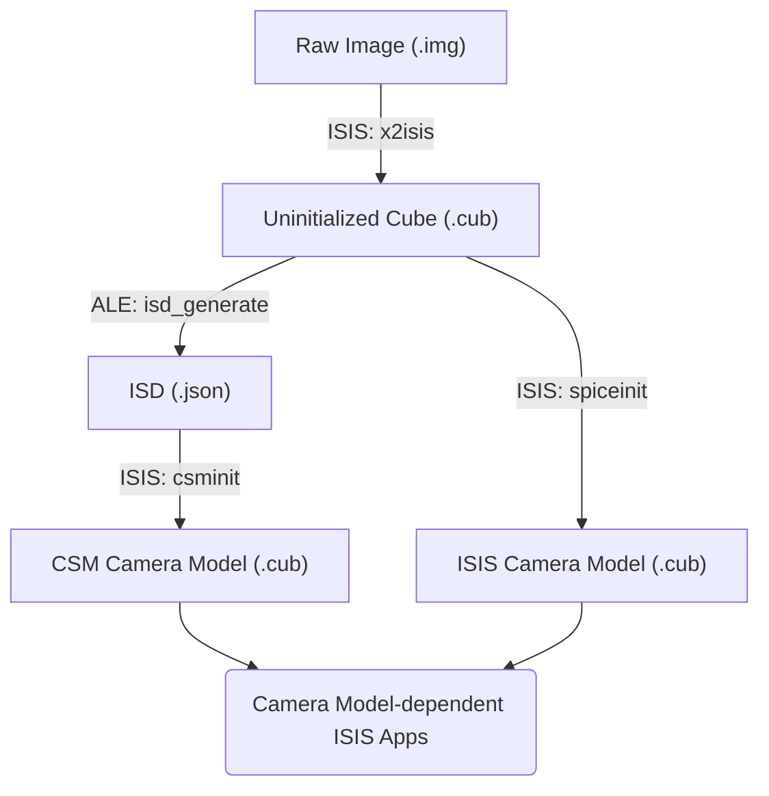

# Pipelines for CSM vs ISIS Camera Models

Two types of camera model are available from USGS Astro: CSM or ISIS.

!!! note "Recommended: CSM"

    Using the CSM Camera Model is recommended.  New missions will only be supported with the CSM Camera Model.  The ISIS Camera Model is going into maintenance mode - Current missions will continue to be supported, but no new missions will be added.

## Example

???+ example "Initializing a Camera Model"

    Starting from an uninitialized MRO CTX Image, run these commands to initialize a camera model.
    
    [[B10_013341_1010_XN_79S172W.IMG - 125MB](https://asc-pds-mars-reconnaissance-orbiter.s3.us-west-2.amazonaws.com/CTX/mrox_0826/data/B10_013341_1010_XN_79S172W.IMG)]

    === "CSM Camera Model"

        ```sh
        mroctx2isis from=B10_013341_1010_XN_79S172W.IMG to=B10_013341_1010_XN_79S172W.cub
        isd_generate B10_013341_1010_XN_79S172W.cub
        csminit from=B10_013341_1010_XN_79S172W.cub isd=B10_013341_1010_XN_79S172W.json
        ```

    === "ISIS Camera Model"
    
        ```sh
        mroctx2isis from=B10_013341_1010_XN_79S172W.IMG to=B10_013341_1010_XN_79S172W.cub
        spiceinit from=B10_013341_1010_XN_79S172W.cub
        ```

## Process

For ether model, the first step is to ingest the image into an ISIS .cub using an `2isis` app.  After that, the process diverges, depending on which Camera Model is preferred. You can attach ***SPICE information*** for the **ISIS Camera Model**, or a ***CSM State String*** for the **CSM Camera Model**.



The ISIS and CSM Camera Models differ slightly from each other. But either way, after a Camera Model is attached, you can do further Camera Model-dependent work in ISIS:

- Control Networks
- Bundle Adjustment
- Mosaics
- DEM/Shape Model Creation

## File Structure

### ISD .json

### CSM Camera Model

### ISIS Camera Model