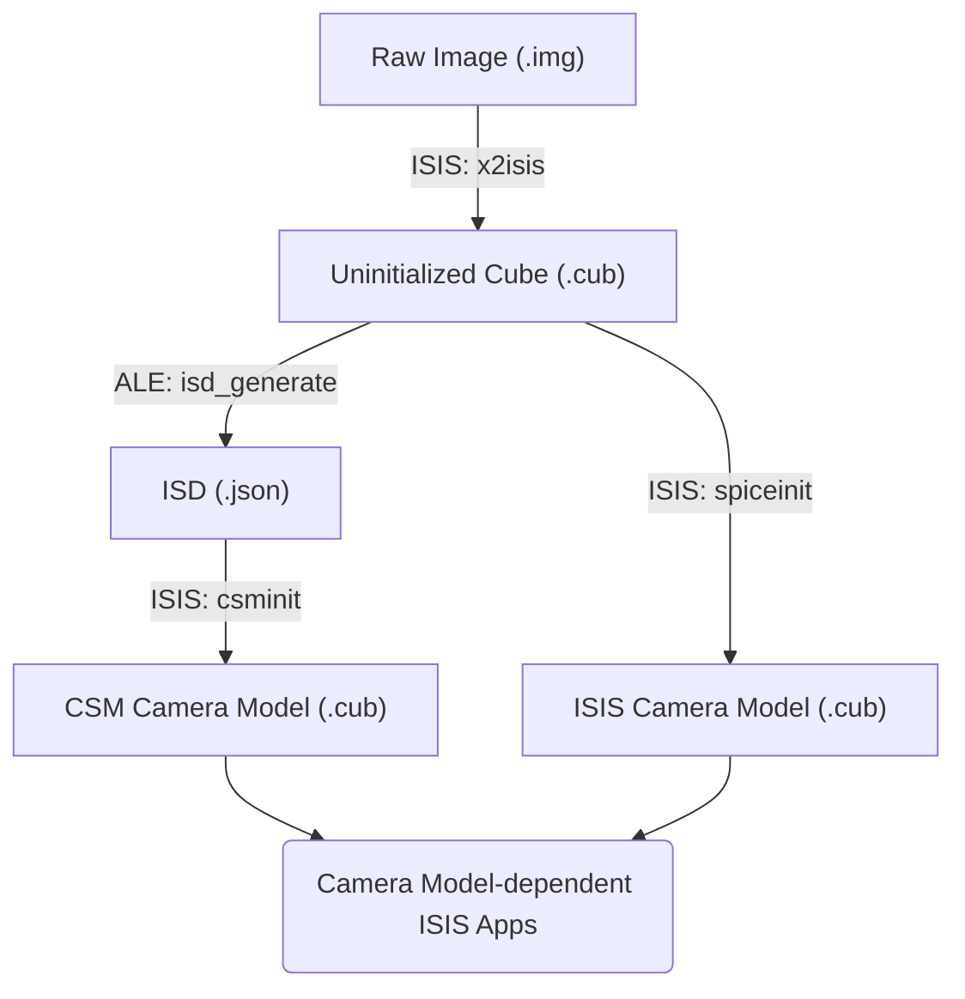

# Pipelines for CSM vs ISIS Camera Models

Two types of camera model are available from USGS Astro: CSM or ISIS.

!!! note "Recommended: CSM"

    Using the CSM Camera Model is recommended.  New missions will only be supported with the CSM Camera Model.  The ISIS Camera Model is going into maintenance mode - Current missions will continue to be supported, but no new missions will be added.

## Example

???+ example "Initializing a Camera Model"

    Starting from an uninitialized MRO CTX Image, run these commands to initialize a camera model.
    
    [[B10_013341_1010_XN_79S172W.IMG - 125MB](https://asc-pds-mars-reconnaissance-orbiter.s3.us-west-2.amazonaws.com/CTX/mrox_0826/data/B10_013341_1010_XN_79S172W.IMG)]

    === "CSM Camera Model"

        ```sh
        mroctx2isis from=B10_013341_1010_XN_79S172W.IMG to=B10_013341_1010_XN_79S172W.cub
        isd_generate B10_013341_1010_XN_79S172W.cub
        csminit from=B10_013341_1010_XN_79S172W.cub isd=B10_013341_1010_XN_79S172W.json
        ```

    === "ISIS Camera Model"
    
        ```sh
        mroctx2isis from=B10_013341_1010_XN_79S172W.IMG to=B10_013341_1010_XN_79S172W.cub
        spiceinit from=B10_013341_1010_XN_79S172W.cub
        ```

??? note "Developers - Updating the CSM Plugin Location for `csminit`"

    Fore development version of ISIS, add the location of the CSM Plugins as a `CSMDirectory` in your `IsisPreferences` file.

    The Isis Preference file may be found under `~/.isis/`, `ISIS3/isis`, and/or `ISIS3/build`.
    If you're not sure which file to update, just update any that are present.

    The CSM Plugin location is commonly `$CONDA_PREFIX/lib/csmplugins/` or `$ISISROOT/lib/csmplugins/`.

    Once added, the Plugin Section of the IsisPreferences file might look like this:
    ```
    ########################################################
    #
    # Indicate where ISIS should search for Community
    # Sensor Model (CSM) plugins. The value of this keyword
    # should be a list of paths, that contain CSM plugin
    # libraries.
    #
    ########################################################
    
    Group = Plugins
      CSMDirectory = ("$ISISROOT/lib/csmplugins/", -
                      "$ISISROOT/lib/isis/csm3.0.3/", -
                      "$ISISROOT/csmlibs/3.0.3/", -
                      "$HOME/.Isis/csm3.0.3/", -
                      "$CONDA_PREFIX/lib/csmplugins/")
    EndGroup
    ```

## Process

For ether model, the first step is to ingest the image into an ISIS .cub using an `2isis` app.  After that, the process diverges, depending on which Camera Model is preferred. You can attach ***SPICE information*** for the **ISIS Camera Model**, or a ***CSM State String*** for the **CSM Camera Model**.



The ISIS and CSM Camera Models differ slightly from each other. But either way, after a Camera Model is attached, you can do further Camera Model-dependent work in ISIS:

- [Camera Geometry](../../concepts/camera-geometry-and-projections/camera-geometry.md)
- [Control Networks](../../concepts/control-networks/isis-control-networks.md)
- [Bundle Adjustment](../../how-to-guides/image-processing/bundle-adjustment-in-isis.md)
- Map Projection ([About](../../concepts/camera-geometry-and-projections/learning-about-map-projections.md); [Tutorial](../../how-to-guides/image-processing/map-projecting-images.md))

## Image Labels

The label can reveal if a .cub has a Camera Model, and which kind it has.
If a `NaifKeywords` Object is present, a Camera Model has been initialized.

```sh title="Readout the label for a .cub"
catlab from=B10_013341_1010_XN_79S172W.cub
```

### Label Comparison

<div class="grid cards" markdown>

- **CSM Camera Model**

    - NaifKeywords Object
    - Kernels not listed, but ShapeModel set (may be Null)
    - CsmInfo Group
    - CSMState String

- **ISIS Camera Model**

    - NaifKeywords Object
    - Kernels listed
    - Instrument Pointing, Instrument Position, Body Rotation, and Sun Position Tables

- **No Camera Model**

    - No NaifKeywords Object
    - Kernels not listed

</div>

??? quote "Sample Labels by Camera Model"

    === "None"

        ```
        Object = IsisCube
          Object = Core
            StartByte   = 65537
            Format      = Tile
            TileSamples = 1000
            TileLines   = 1024
        
            Group = Dimensions
              Samples = 5000
              Lines   = 24576
              Bands   = 1
            End_Group
        
            Group = Pixels
              Type       = SignedWord
              ByteOrder  = Lsb
              Base       = 0.0
              Multiplier = 1.0
            End_Group
          End_Object
        
          Group = Instrument
            SpacecraftName        = Mars_Reconnaissance_Orbiter
            InstrumentId          = CTX
            TargetName            = Mars
            MissionPhaseName      = ESP
            StartTime             = 2009-06-01T00:38:16.057
            SpacecraftClockCount  = 0928283918:060
            OffsetModeId          = 196/202/188
            LineExposureDuration  = 1.877 <MSEC>
            FocalPlaneTemperature = 295.2 <K>
            SampleBitModeId       = SQROOT
            SpatialSumming        = 1
            SampleFirstPixel      = 0
          End_Group
        
          Group = Archive
            DataSetId           = MRO-M-CTX-2-EDR-L0-V1.0
            ProductId           = B10_013341_1010_XN_79S172W
            ProducerId          = MRO_CTX_TEAM
            ProductCreationTime = 2009-12-02T19:21:25
            OrbitNumber         = 13341
          End_Group
        
          Group = BandBin
            FilterName = BroadBand
            Center     = 0.65 <micrometers>
            Width      = 0.15 <micrometers>
          End_Group
        
          Group = Kernels
            NaifFrameCode = -74021
          End_Group
        End_Object
        
        Object = Label
          Bytes = 65536
        End_Object
        
        Object = Table
          Name      = "Ctx Prefix Dark Pixels"
          StartByte = 245826105
          Bytes     = 2359296
          Records   = 24576
          ByteOrder = Lsb
        
          Group = Field
            Name = DarkPixels
            Type = Integer
            Size = 24
          End_Group
        End_Object
        
        Object = History
          Name      = IsisCube
          StartByte = 245825537
          Bytes     = 568
        End_Object
        
        Object = OriginalLabel
          Name      = IsisCube
          StartByte = 248185401
          Bytes     = 1714
        End_Object
        End
        ```

    === "CSM Camera Model"

        ```
        Object = IsisCube
          Object = Core
            StartByte   = 65537
            Format      = Tile
            TileSamples = 1000
            TileLines   = 1024
        
            Group = Dimensions
              Samples = 5000
              Lines   = 24576
              Bands   = 1
            End_Group
        
            Group = Pixels
              Type       = SignedWord
              ByteOrder  = Lsb
              Base       = 0.0
              Multiplier = 1.0
            End_Group
          End_Object
        
          Group = Instrument
            SpacecraftName        = Mars_Reconnaissance_Orbiter
            InstrumentId          = CTX
            TargetName            = Mars
            MissionPhaseName      = ESP
            StartTime             = 2009-06-01T00:38:16.057
            SpacecraftClockCount  = 0928283918:060
            OffsetModeId          = 196/202/188
            LineExposureDuration  = 1.877 <MSEC>
            FocalPlaneTemperature = 295.2 <K>
            SampleBitModeId       = SQROOT
            SpatialSumming        = 1
            SampleFirstPixel      = 0
          End_Group
        
          Group = Archive
            DataSetId           = MRO-M-CTX-2-EDR-L0-V1.0
            ProductId           = B10_013341_1010_XN_79S172W
            ProducerId          = MRO_CTX_TEAM
            ProductCreationTime = 2009-12-02T19:21:25
            OrbitNumber         = 13341
          End_Group
        
          Group = BandBin
            FilterName = BroadBand
            Center     = 0.65 <micrometers>
            Width      = 0.15 <micrometers>
          End_Group
        
          Group = Kernels
            NaifFrameCode = -74021
            ShapeModel    = Null
          End_Group
        
          Group = CsmInfo
            CSMPlatformID       = Mars_Reconnaissance_Orbiter
            CSMInstrumentId     = "CONTEXT CAMERA"
            ReferenceTime       = 2009-05-31T12:39:45Z
            ModelParameterNames = ("IT Pos. Bias   ", "CT Pos. Bias   ",
                                   "Rad Pos. Bias  ", "IT Vel. Bias   ",
                                   "CT Vel. Bias   ", "Rad Vel. Bias  ",
                                   "Omega Bias     ", "Phi Bias       ",
                                   "Kappa Bias     ", "Omega Rate     ",
                                   "Phi Rate       ", "Kappa Rate     ",
                                   "Omega Accl     ", "Phi Accl       ",
                                   "Kappa Accl     ", "Focal Bias     ")
            ModelParameterUnits = (m, m, m, m, m, m, m, m, m, m, m, m, m, m, m, m)
            ModelParameterTypes = (REAL, REAL, REAL, REAL, REAL, REAL, REAL, REAL,
                                   REAL, REAL, REAL, REAL, REAL, REAL, REAL, REAL)
          End_Group
        End_Object
        
        Object = Label
          Bytes = 65536
        End_Object
        
        Object = Table
          Name      = "Ctx Prefix Dark Pixels"
          StartByte = 245826105
          Bytes     = 2359296
          Records   = 24576
          ByteOrder = Lsb
        
          Group = Field
            Name = DarkPixels
            Type = Integer
            Size = 24
          End_Group
        End_Object
        
        Object = History
          Name      = IsisCube
          StartByte = 257709736
          Bytes     = 1095
        End_Object
        
        Object = OriginalLabel
          Name      = IsisCube
          StartByte = 248185401
          Bytes     = 1714
        End_Object
        
        Object = String
          Name       = CSMState
          StartByte  = 248187115
          Bytes      = 9522621
          ModelName  = USGS_ASTRO_LINE_SCANNER_SENSOR_MODEL
          PluginName = UsgsAstroPluginCSM
        End_Object
        
        Object = NaifKeywords
          BODY499_PM                 = (176.63, 350.89198226, 0)
          BODY499_POLE_DEC           = (52.8865, -0.0609, 0)
          BODY499_POLE_RA            = (317.68143, -0.1061, 0)
          BODY499_RADII              = (3396.19, 3396.19, 3376.2)
          BODY_CODE                  = 499
          BODY_FRAME_CODE            = 10014
          FRAME_-74021_CENTER        = -74
          FRAME_-74021_CLASS         = 4
          FRAME_-74021_CLASS_ID      = -74021
          FRAME_-74021_NAME          = MRO_CTX
          INS-74021_BORESIGHT        = (0, 0, 1)
          INS-74021_BORESIGHT_LINE   = 0.430442527
          INS-74021_BORESIGHT_SAMPLE = 2543.46099
          INS-74021_CCD_CENTER       = (2500.5, 0.5)
          INS-74021_CK_FRAME_ID      = -74000
          INS-74021_CK_REFERENCE_ID  = -74900
          INS-74021_F/RATIO          = 3.25
          INS-74021_FOCAL_LENGTH     = 352.9271664
          INS-74021_FOV_ANGLE_UNITS  = DEGREES
          INS-74021_FOV_ANGULAR_SIZE = (5.73, 0.001146)
          INS-74021_FOV_CLASS_SPEC   = ANGLES
          INS-74021_FOV_CROSS_ANGLE  = 0.00057296
          INS-74021_FOV_FRAME        = MRO_CTX
          INS-74021_FOV_REF_ANGLE    = 2.86478898
          INS-74021_FOV_REF_VECTOR   = (0, 1, 0)
          INS-74021_FOV_SHAPE        = RECTANGLE
          INS-74021_IFOV             = (2e-05, 2e-05)
          INS-74021_ITRANSL          = (0, 142.85714285714, 0)
          INS-74021_ITRANSS          = (0, 0, 142.85714285714)
          INS-74021_OD_K             = (-0.007343392592005451, 2.83758786362417e-05,
                                        1.28419891240271e-08)
          INS-74021_PIXEL_LINES      = 1
          INS-74021_PIXEL_PITCH      = 0.007
          INS-74021_PIXEL_SAMPLES    = 5000
          INS-74021_PIXEL_SIZE       = (0.007, 0.007)
          INS-74021_PLATFORM_ID      = -74000
          INS-74021_TRANSX           = (0, 0, 0.007)
          INS-74021_TRANSY           = (0, 0.007, 0)
          SCLK01_COEFFICIENTS_74999  = (0, -631195148.816, 1, 3097283854336,
                                        -583934347.816, 1, 5164027215872,
                                        -552398346.816, 1, 7230770577408,
                                        -520862345.816, 1, 11369919545344,
                                        -457703944.816, 1, 16545271316480,
                                        -378734343.816, 1, 20684420284416,
                                        -315575942.816, 1, 22751163645952,
                                        -284039941.816, 1, 25848447500288,
                                        -236779140.816, 1, 27915190861824,
                                        -205243139.816, 1, 29981934223360,
                                        -173707138.816, 1, 33090542698496,
                                        -126273537.816, 1, 36187826552832,
                                        -79012736.816, 1, 39296435027968,
                                        -31579135.816, 0.99999999999999,
                                        52973626698957, 177118246.859,
                                        0.99999852023164, 52993689169101,
                                        177424375.406, 1, 52995043929293.01,
                                        177445047.406, 1.0000000226389,
                                        53096363306188.99, 178991058.441,
                                        1.0000000201904, 53284625886413, 181863717.499,
                                        1.0000000150408, 53363055635660.99,
                                        183060460.517, 1.0000000132783, 53599962770637,
                                        186675376.565, 1.0000000070773, 53627742694605,
                                        187099264.568, 1.0000000106838, 53774962830541,
                                        189345665.592, 0.99999997549027,
                                        53791006043341, 189590465.586, 1,
                                        53792386231501.01, 189611525.586,
                                        0.9999987249048899, 53797217545421,
                                        189685245.492, 1.0000000061688, 53892831227085,
                                        191144194.501, 1.0000000031304, 54018442177741,
                                        193060865.507, 1.0000000020774, 54239272283341,
                                        196430465.514, 1, 54625917840589.01,
                                        202330208.514, 0.9999990357606199,
                                        54630607531213, 202401767.445,
                                        0.99999999979331, 54947686296781.01,
                                        207240005.444, 0.99999949258425,
                                        54952723393741.01, 207316865.405,
                                        0.9999999952330499, 55103951580365.01,
                                        209624424.394, 0.99999999390912,
                                        55480540900557, 215370721.359,
                                        0.9999999917298601, 55734122228941,
                                        219240065.327, 0.9999999909164601,
                                        56253588483277, 227166491.255,
                                        0.9999990477698499, 56282150317261,
                                        227602309.84, 0.99999999099945, 56987144394888,
                                        238359665.664, 0.9999999831211401,
                                        57666621642887.99, 248727665.489,
                                        0.99999998135288, 57972386404488,
                                        253393265.402, 0.9999999820012601,
                                        58187590238531, 256677015.252, 0.9999999809459,
                                        58555613610307, 262292606.145,
                                        0.9999999770547999, 59980855214403.01,
                                        284040066.646, 0.9999999769993601,
                                        60316686887734, 289164451.192,
                                        0.9999999771683801, 60526226516790,
                                        292361772.119, 0.9999999760003601,
                                        60877151798382, 297716466.839,
                                        0.9999999759615801, 60950761833582,
                                        298839666.812, 0.99999997699925,
                                        61228279462147, 303074249.67, 0.99999996699968,
                                        61339176585694, 304766405.43,
                                        0.9999990077562799, 61540822010334.01,
                                        307843267.377, 0.99999906859216,
                                        61648405973470, 309484866.848,
                                        0.9999991604094201, 61747538479581.99,
                                        310997507.578, 0.99999917299955,
                                        61899057574089, 313309503.568,
                                        0.99999997132958, 62100211544265, 316378869.48,
                                        0.9999999697981201, 63419529736393,
                                        336510066.872, 0.9999999679956, 63521451511732,
                                        338065269.693, 0.99999996913538,
                                        63538438246324, 338324466.685,
                                        0.99999996880886, 64206591135668,
                                        348519670.367, 0.99999996800035,
                                        65622287286835.01, 370121478.623,
                                        0.9999999657405499, 65673936470578.99,
                                        370909582.596, 0.99999996300108,
                                        65888349410862.01, 374181264.303,
                                        0.99999996157694, 65900288955950.01,
                                        374363447.296, 0.9999999631076,
                                        66545125381677.99, 384202869.933,
                                        0.9999999621435499, 67211626370606,
                                        394372867.548, 0.9999999483391899,
                                        67343558989358, 396385999.444,
                                        0.9999999580000299, 67842962571636.99,
                                        404006293.043)
          SCLK01_MODULI_74999        = (4294967296, 65536)
          SCLK01_N_FIELDS_74999      = 2
          SCLK01_OFFSETS_74999       = (0, 0)
          SCLK01_OUTPUT_DELIM_74999  = 1
          SCLK01_TIME_SYSTEM_74999   = 2
          SCLK_DATA_TYPE_74999       = 1
          SCLK_PARTITION_END_74999   = (52973626698957, 56987144678331,
                                        58187590527162.99, 60316687182323,
                                        60877152115000, 61228279788693,
                                        61339176915162.99, 61899057915627,
                                        63521451859691, 65622287643263,
                                        65888349770746.99, 67842962942791,
                                        69529271265267, 70724085076049, 71692166304603,
                                        281474976710650)
          SCLK_PARTITION_START_74999 = (0, 52973626982399.99, 56987144683520,
                                        58187590533120, 60316687204352.01,
                                        60877152124927.99, 61228279791616,
                                        61339176927232, 61899057922048, 63521451868160,
                                        65622287646719.99, 65888349782016,
                                        67842962948096, 69529271271424.01,
                                        70724085088256, 71692166299648)
          TKFRAME_-74021_ANGLES      = (0, 0, 0)
          TKFRAME_-74021_AXES        = (1, 2, 3)
          TKFRAME_-74021_RELATIVE    = MRO_CTX_BASE
          TKFRAME_-74021_SPEC        = ANGLES
          TKFRAME_-74021_UNITS       = DEGREES
        End_Object
        End
        ```

    === "ISIS Camera Model"

        ```
        Object = IsisCube
          Object = Core
            StartByte   = 65537
            Format      = Tile
            TileSamples = 1000
            TileLines   = 1024
        
            Group = Dimensions
              Samples = 5000
              Lines   = 24576
              Bands   = 1
            End_Group
        
            Group = Pixels
              Type       = SignedWord
              ByteOrder  = Lsb
              Base       = 0.0
              Multiplier = 1.0
            End_Group
          End_Object
        
          Group = Instrument
            SpacecraftName        = Mars_Reconnaissance_Orbiter
            InstrumentId          = CTX
            TargetName            = Mars
            MissionPhaseName      = ESP
            StartTime             = 2009-06-01T00:38:16.057
            SpacecraftClockCount  = 0928283918:060
            OffsetModeId          = 196/202/188
            LineExposureDuration  = 1.877 <MSEC>
            FocalPlaneTemperature = 295.2 <K>
            SampleBitModeId       = SQROOT
            SpatialSumming        = 1
            SampleFirstPixel      = 0
          End_Group
        
          Group = Archive
            DataSetId           = MRO-M-CTX-2-EDR-L0-V1.0
            ProductId           = B10_013341_1010_XN_79S172W
            ProducerId          = MRO_CTX_TEAM
            ProductCreationTime = 2009-12-02T19:21:25
            OrbitNumber         = 13341
          End_Group
        
          Group = BandBin
            FilterName = BroadBand
            Center     = 0.65 <micrometers>
            Width      = 0.15 <micrometers>
          End_Group
        
          Group = Kernels
            NaifFrameCode             = -74021
            LeapSecond                = $base/kernels/lsk/naif0012.tls
            TargetAttitudeShape       = $mro/kernels/pck/pck00008.tpc
            TargetPosition            = (Table, $base/kernels/spk/de430.bsp,
                                         $base/kernels/spk/mar097.bsp)
            InstrumentPointing        = (Table,
                                         $mro/kernels/ck/mro_sc_psp_090526_090601.bc,
                                         $mro/kernels/fk/mro_v16.tf)
            Instrument                = Null
            SpacecraftClock           = $mro/kernels/sclk/MRO_SCLKSCET.00114.65536.tsc
            InstrumentPosition        = (Table,
                                         $mro/kernels/spk/mro_psp11_ssd_mro110c.bsp)
            InstrumentAddendum        = $mro/kernels/iak/mroctxAddendum005.ti
            ShapeModel                = $base/dems/molaMarsPlanetaryRadius0005.cub
            InstrumentPositionQuality = Reconstructed
            InstrumentPointingQuality = Reconstructed
            CameraVersion             = 1
            Source                    = ale
          End_Group
        End_Object
        
        Object = Label
          Bytes = 65536
        End_Object
        
        Object = Table
          Name      = "Ctx Prefix Dark Pixels"
          StartByte = 245826105
          Bytes     = 2359296
          Records   = 24576
          ByteOrder = Lsb
        
          Group = Field
            Name = DarkPixels
            Type = Integer
            Size = 24
          End_Group
        End_Object
        
        Object = Table
          Name                = InstrumentPointing
          StartByte           = 248187115
          Bytes               = 14848
          Records             = 232
          ByteOrder           = Lsb
          TimeDependentFrames = (-74000, -74900, 1)
          ConstantFrames      = (-74021, -74020, -74699, -74690, -74000)
          ConstantRotation    = (0.99999956087984, -1.51960241928035e-05,
                                 9.37021451059407e-04, 1.52765520753567e-05,
                                 0.99999999619106, -8.59331791187953e-05,
                                 -9.37020141647677e-04, 8.59474558407972e-05,
                                 0.99999955730305)
          CkTableStartTime    = 297088762.24158
          CkTableEndTime      = 297088808.37074
          CkTableOriginalSize = 24577
          FrameTypeCode       = 3
          Description         = "Created by spiceinit"
          Kernels             = ($mro/kernels/ck/mro_sc_psp_090526_090601.bc,
                                 $mro/kernels/fk/mro_v16.tf)
        
          Group = Field
            Name = J2000Q0
            Type = Double
            Size = 1
          End_Group
        
          Group = Field
            Name = J2000Q1
            Type = Double
            Size = 1
          End_Group
        
          Group = Field
            Name = J2000Q2
            Type = Double
            Size = 1
          End_Group
        
          Group = Field
            Name = J2000Q3
            Type = Double
            Size = 1
          End_Group
        
          Group = Field
            Name = AV1
            Type = Double
            Size = 1
          End_Group
        
          Group = Field
            Name = AV2
            Type = Double
            Size = 1
          End_Group
        
          Group = Field
            Name = AV3
            Type = Double
            Size = 1
          End_Group
        
          Group = Field
            Name = ET
            Type = Double
            Size = 1
          End_Group
        End_Object
        
        Object = Table
          Name                 = InstrumentPosition
          StartByte            = 248201963
          Bytes                = 672
          Records              = 12
          ByteOrder            = Lsb
          CacheType            = HermiteSpline
          SpkTableStartTime    = 297088762.24158
          SpkTableEndTime      = 297088808.37074
          SpkTableOriginalSize = 24577.0
          Description          = "Created by spiceinit"
          Kernels              = $mro/kernels/spk/mro_psp11_ssd_mro110c.bsp
        
          Group = Field
            Name = J2000X
            Type = Double
            Size = 1
          End_Group
        
          Group = Field
            Name = J2000Y
            Type = Double
            Size = 1
          End_Group
        
          Group = Field
            Name = J2000Z
            Type = Double
            Size = 1
          End_Group
        
          Group = Field
            Name = J2000XV
            Type = Double
            Size = 1
          End_Group
        
          Group = Field
            Name = J2000YV
            Type = Double
            Size = 1
          End_Group
        
          Group = Field
            Name = J2000ZV
            Type = Double
            Size = 1
          End_Group
        
          Group = Field
            Name = ET
            Type = Double
            Size = 1
          End_Group
        End_Object
        
        Object = Table
          Name                = BodyRotation
          StartByte           = 248202635
          Bytes               = 128
          Records             = 2
          ByteOrder           = Lsb
          TimeDependentFrames = (10014, 1)
          CkTableStartTime    = 297088762.24158
          CkTableEndTime      = 297088808.37074
          CkTableOriginalSize = 2
          FrameTypeCode       = 3
          Description         = "Created by spiceinit"
          Kernels             = ($base/kernels/spk/de430.bsp,
                                 $base/kernels/spk/mar097.bsp,
                                 $mro/kernels/pck/pck00008.tpc)
          SolarLongitude      = 276.65499960261
        
          Group = Field
            Name = J2000Q0
            Type = Double
            Size = 1
          End_Group
        
          Group = Field
            Name = J2000Q1
            Type = Double
            Size = 1
          End_Group
        
          Group = Field
            Name = J2000Q2
            Type = Double
            Size = 1
          End_Group
        
          Group = Field
            Name = J2000Q3
            Type = Double
            Size = 1
          End_Group
        
          Group = Field
            Name = AV1
            Type = Double
            Size = 1
          End_Group
        
          Group = Field
            Name = AV2
            Type = Double
            Size = 1
          End_Group
        
          Group = Field
            Name = AV3
            Type = Double
            Size = 1
          End_Group
        
          Group = Field
            Name = ET
            Type = Double
            Size = 1
          End_Group
        End_Object
        
        Object = Table
          Name                 = SunPosition
          StartByte            = 248202763
          Bytes                = 112
          Records              = 2
          ByteOrder            = Lsb
          CacheType            = Linear
          SpkTableStartTime    = 297088762.24158
          SpkTableEndTime      = 297088808.37074
          SpkTableOriginalSize = 2.0
          Description          = "Created by spiceinit"
          Kernels              = ($base/kernels/spk/de430.bsp,
                                  $base/kernels/spk/mar097.bsp)
        
          Group = Field
            Name = J2000X
            Type = Double
            Size = 1
          End_Group
        
          Group = Field
            Name = J2000Y
            Type = Double
            Size = 1
          End_Group
        
          Group = Field
            Name = J2000Z
            Type = Double
            Size = 1
          End_Group
        
          Group = Field
            Name = J2000XV
            Type = Double
            Size = 1
          End_Group
        
          Group = Field
            Name = J2000YV
            Type = Double
            Size = 1
          End_Group
        
          Group = Field
            Name = J2000ZV
            Type = Double
            Size = 1
          End_Group
        
          Group = Field
            Name = ET
            Type = Double
            Size = 1
          End_Group
        End_Object
        
        Object = History
          Name      = IsisCube
          StartByte = 248202875
          Bytes     = 1507
        End_Object
        
        Object = OriginalLabel
          Name      = IsisCube
          StartByte = 248185401
          Bytes     = 1714
        End_Object
        
        Object = NaifKeywords
          BODY499_PM                           = (176.63, 350.89198226, 0)
          BODY499_POLE_DEC                     = (52.8865, -0.0609, 0)
          BODY499_POLE_RA                      = (317.68143, -0.1061, 0)
          BODY499_RADII                        = (3396.19, 3396.19, 3376.2)
          BODY_CODE                            = 499
          BODY_FRAME_CODE                      = 10014
          FRAME_-74021_CENTER                  = -74
          FRAME_-74021_CLASS                   = 4
          FRAME_-74021_CLASS_ID                = -74021
          FRAME_-74021_NAME                    = MRO_CTX
          INS-74021_BORESIGHT_LINE             = 0.430442527
          INS-74021_BORESIGHT_SAMPLE           = 2543.46099
          INS-74021_CK_FRAME_ID                = -74000
          INS-74021_CK_REFERENCE_ID            = -74900
          INS-74021_FOCAL_LENGTH               = 352.9271664
          INS-74021_ITRANSL                    = (0, 142.85714285714, 0)
          INS-74021_ITRANSS                    = (0, 0, 142.85714285714)
          INS-74021_OD_K                       = (-0.007343392592005451,
                                                  2.83758786362417e-05,
                                                  1.28419891240271e-08)
          INS-74021_PIXEL_PITCH                = 0.007
          INS-74021_TRANSX                     = (0, 0, 0.007)
          INS-74021_TRANSY                     = (0, 0.007, 0)
          SCLK01_COEFFICIENTS_74999            = (0, -631195148.816, 1, 3097283854336,
                                                  -583934347.816, 1, 5164027215872,
                                                  -552398346.816, 1, 7230770577408,
                                                  -520862345.816, 1, 11369919545344,
                                                  -457703944.816, 1, 16545271316480,
                                                  -378734343.816, 1, 20684420284416,
                                                  -315575942.816, 1, 22751163645952,
                                                  -284039941.816, 1, 25848447500288,
                                                  -236779140.816, 1, 27915190861824,
                                                  -205243139.816, 1, 29981934223360,
                                                  -173707138.816, 1, 33090542698496,
                                                  -126273537.816, 1, 36187826552832,
                                                  -79012736.816, 1, 39296435027968,
                                                  -31579135.816, 0.99999999999999,
                                                  52973626698957, 177118246.859,
                                                  0.99999852023164, 52993689169101,
                                                  177424375.406, 1, 52995043929293.01,
                                                  177445047.406, 1.0000000226389,
                                                  53096363306188.99, 178991058.441,
                                                  1.0000000201904, 53284625886413,
                                                  181863717.499, 1.0000000150408,
                                                  53363055635660.99, 183060460.517,
                                                  1.0000000132783, 53599962770637,
                                                  186675376.565, 1.0000000070773,
                                                  53627742694605, 187099264.568,
                                                  1.0000000106838, 53774962830541,
                                                  189345665.592, 0.99999997549027,
                                                  53791006043341, 189590465.586, 1,
                                                  53792386231501.01, 189611525.586,
                                                  0.9999987249048899, 53797217545421,
                                                  189685245.492, 1.0000000061688,
                                                  53892831227085, 191144194.501,
                                                  1.0000000031304, 54018442177741,
                                                  193060865.507, 1.0000000020774,
                                                  54239272283341, 196430465.514, 1,
                                                  54625917840589.01, 202330208.514,
                                                  0.9999990357606199, 54630607531213,
                                                  202401767.445, 0.99999999979331,
                                                  54947686296781.01, 207240005.444,
                                                  0.99999949258425, 54952723393741.01,
                                                  207316865.405, 0.9999999952330499,
                                                  55103951580365.01, 209624424.394,
                                                  0.99999999390912, 55480540900557,
                                                  215370721.359, 0.9999999917298601,
                                                  55734122228941, 219240065.327,
                                                  0.9999999909164601, 56253588483277,
                                                  227166491.255, 0.9999990477698499,
                                                  56282150317261, 227602309.84,
                                                  0.99999999099945, 56987144394888,
                                                  238359665.664, 0.9999999831211401,
                                                  57666621642887.99, 248727665.489,
                                                  0.99999998135288, 57972386404488,
                                                  253393265.402, 0.9999999820012601,
                                                  58187590238531, 256677015.252,
                                                  0.9999999809459, 58555613610307,
                                                  262292606.145, 0.9999999770547999,
                                                  59980855214403.01, 284040066.646,
                                                  0.9999999769993601, 60316686887734,
                                                  289164451.192, 0.9999999771683801,
                                                  60526226516790, 292361772.119,
                                                  0.9999999760003601, 60877151798382,
                                                  297716466.839, 0.9999999759615801,
                                                  60950761833582, 298839666.812,
                                                  0.99999997699925, 61228279462147,
                                                  303074249.67, 0.99999996699968,
                                                  61339176585694, 304766405.43,
                                                  0.9999990077562799,
                                                  61540822010334.01, 307843267.377,
                                                  0.99999906859216, 61648405973470,
                                                  309484866.848, 0.9999991604094201,
                                                  61747538479581.99, 310997507.578,
                                                  0.99999917299955, 61899057574089,
                                                  313309503.568, 0.99999997132958,
                                                  62100211544265, 316378869.48,
                                                  0.9999999697981201, 63419529736393,
                                                  336510066.872, 0.9999999679956,
                                                  63521451511732, 338065269.693,
                                                  0.99999996913538, 63538438246324,
                                                  338324466.685, 0.99999996880886,
                                                  64206591135668, 348519670.367,
                                                  0.99999996800035, 65622287286835.01,
                                                  370121478.623, 0.9999999657405499,
                                                  65673936470578.99, 370909582.596,
                                                  0.99999996300108, 65888349410862.01,
                                                  374181264.303, 0.99999996157694,
                                                  65900288955950.01, 374363447.296,
                                                  0.9999999631076, 66545125381677.99,
                                                  384202869.933, 0.9999999621435499,
                                                  67211626370606, 394372867.548,
                                                  0.9999999483391899, 67343558989358,
                                                  396385999.444, 0.9999999580000299,
                                                  67842962571636.99, 404006293.043)
          SCLK01_MODULI_74999                  = (4294967296, 65536)
          SCLK01_N_FIELDS_74999                = 2
          SCLK01_OFFSETS_74999                 = (0, 0)
          SCLK01_OUTPUT_DELIM_74999            = 1
          SCLK01_TIME_SYSTEM_74999             = 2
          SCLK_DATA_TYPE_74999                 = 1
          SCLK_PARTITION_END_74999             = (52973626698957, 56987144678331,
                                                  58187590527162.99, 60316687182323,
                                                  60877152115000, 61228279788693,
                                                  61339176915162.99, 61899057915627,
                                                  63521451859691, 65622287643263,
                                                  65888349770746.99, 67842962942791,
                                                  69529271265267, 70724085076049,
                                                  71692166304603, 75099259007666,
                                                  79809852390453, 83047459403679,
                                                  83339739513255, 83670199669409,
                                                  83696265279213, 84370208048567,
                                                  85222415648003, 85242076343532.98,
                                                  85281866692896, 86114551008961.98,
                                                  88075739900029, 88506310182792,
                                                  88602117136170.98, 281474976710650)
          SCLK_PARTITION_START_74999           = (0, 52973626982399.99,
                                                  56987144683520, 58187590533120,
                                                  60316687204352.01, 60877152124927.99,
                                                  61228279791616, 61339176927232,
                                                  61899057922048, 63521451868160,
                                                  65622287646719.99, 65888349782016,
                                                  67842962948096, 69529271271424.01,
                                                  70724085088256, 71692166299648,
                                                  75099259011072, 79809852407808,
                                                  83047459454976.02, 83339739529216,
                                                  83670199697408, 83696265265152,
                                                  84370208063487.98, 85222415663104,
                                                  85242076332032.02, 85281866711040.02,
                                                  86114551070720, 88075739922431.98,
                                                  88506310197248, 88602117144576)
          TKFRAME_-74021_ANGLES                = (0, 0, 0)
          TKFRAME_-74021_AXES                  = (1, 2, 3)
          TKFRAME_-74021_RELATIVE              = MRO_CTX_BASE
          TKFRAME_-74021_SPEC                  = ANGLES
          TKFRAME_-74021_UNITS                 = DEGREES
          CLOCK_ET_-74_0928283918:060_COMPUTED = 74d83dfa36b5b141
        End_Object
        End
        ```