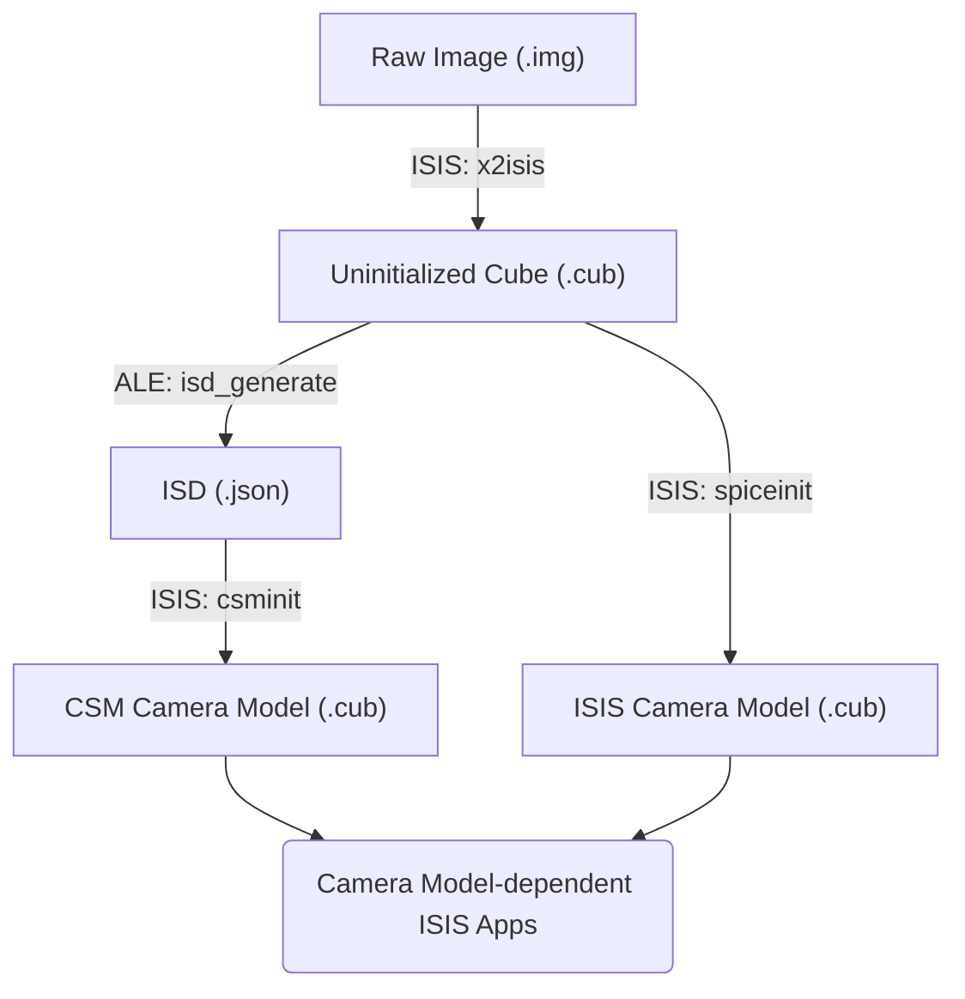

# Pipelines for CSM vs ISIS Camera Models

Two types of camera model are available from USGS Astro: CSM or ISIS.

For ether model, the first step is to ingest the image into an ISIS .cub using an `2isis` app.  After that, the process diverges, depending on which Camera Model is preferred. You can attach ***SPICE information*** for the **ISIS Camera Model**, or a ***CSM State String*** for the **CSM Camera Model**.

The ISIS and CSM Camera Models differ slightly from each other. But either way, after a Camera Model is attached, you can do further Camera Model-dependent work in ISIS:

- Control Networks
- Bundle Adjustment
- Mosaics
- DEM/Shape Model Creation