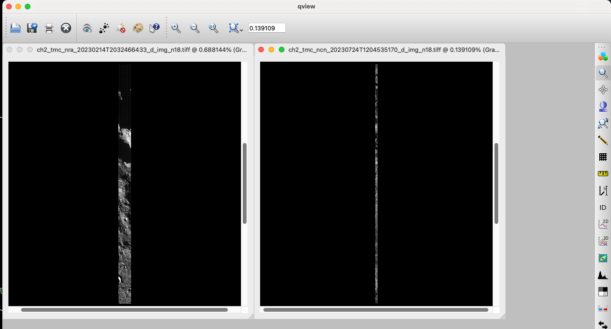

# Processing Chandrayaan 2 TMC-2 Images 

More info on Chandrayaan 2:

- [Chandrayaan 2 Mission - USGS Astro](https://astrogeology.usgs.gov/docs/concepts/missions/chandrayaan2)
- [Processing Chandrayaan 2 OHRC Images](ingesting-ohrc.md)
- [Chandrayaan 2 Stereo - Ames Stereo Pipeline](https://stereopipeline.readthedocs.io/en/latest/examples/chandrayaan2.html)

### Environment 

You will need: 

* ISIS 10.0.0_RC2
* ALE >= 1.1.3
* SpiceQL >= 1.2.7
* usgscsm 

To install these with conda:
```sh
conda create -n ch2 \
    -c usgs-astrogeology/label/RC \
    -c conda-forge \
    matplotlib isis=10.0.0_RC2 ale=1.1.3 usgscsm=2.0.2
conda activate ch2 # activate env
```

!!! Note "ISIS 10 release candidate"

    ISIS 10 has not been formally released yet, so the command above installs the
    `10.0.0_RC2` release candidate from the `usgs-astrogeology/label/RC` channel.


### Image Data, Label, and Template

The `.img` image and `.xml` label are required to import a TMC image into the ISIS cube format.  These can be downloaded [ISRO's interactive map](https://chmapbrowse.issdc.gov.in) or [ISRO's PRADAN system for bulk downloads](https://pradan.issdc.gov.in/ch2/protected/payload.xhtml).  (New users must register an account.)

!!! Note "SPICE Kernel Coverage"

    Chandrayaan 2 SPICE kernels are distributed through the ISIS data area and fetched with `downloadIsisData chandrayaan2 $ISISDATA`. Coverage may still lag for the most recent acquisitions. You can check which kernels are available with the following CURL command: 

    ```bash
    curl -XGET "https://astrogeology.usgs.gov/apis/spiceql/latest/searchForKernelsets?spiceqlNames=\[chandrayaan2\]&limitCk=-1&limitSpk=-1" | jq
    ```

    The filenames for CKs and SPKs tell you their time coverage. 

!!! Example "Example Data"

    To follow along you can download an example image from [here](https://asc-isisdata.s3.us-west-2.amazonaws.com/staged_data/ch2_tmc2.zip). 

### Set Environmental Variables

ISIS requires `ISISROOT` and `ISISDATA` to be set.  You can set `ISISROOT` equal to the `CONDA_PREFIX` as below.  You will need to [set up the ISIS Data Area](https://astrogeology.usgs.gov/docs/how-to-guides/environment-setup-and-maintenance/isis-data-area/) and set `ISISDATA` to point to it.

### Create a ISIS compatible Cube or GTiff

Once set up you can import with `isisimport`

```sh
isisimport from=ch2_tmc_nra_20230214T2032466433_d_img_n18.xml to=ch2_tmc_nra_20230214T2032466433_d_img_n18.cub 
# create and ISD, this creates a file ch2_tmc_nra_20230214T2032466433_d_img_n18.json 
isd_generate -s ch2_tmc_nra_20230214T2032466433_d_img_n18.cub  
```

!!! Warning "Local Kernels"

    `isd_generate -s` assumes you have local SPICE kernels set up, so make sure you have ISISDATA set with `base` and `chandrayaan2` installed. You can install these data with: 

    ```bash 
    downloadIsisData base $ISISDATA 
    downloadIsisData chandrayaan2 $ISISDATA
    ```

    You can troubleshoot isd_generate with `-v`, most common issue is missing kernels covering the images time range. 

    !!! Tip "Avoiding ISISDATA Downloads"

        You can skip ISISDATA downloads using `isd_generate -w` for web camera generation. This is feature is experimental so use with caution. For example: 

        ```bash
        isd_generate -w ch2_tmc_nra_20230214T2032466433_d_img_n18.cub 
        ``` 

Check you have the files, you will need the .json and .cub

```
ls -1
# ch2_tmc_nra_20230214T2032466433_d_img_n18.cub
# ch2_tmc_nra_20230214T2032466433_d_img_n18.img
# ch2_tmc_nra_20230214T2032466433_d_img_n18.json
# ch2_tmc_nra_20230214T2032466433_d_img_n18.xml
```

From here you can use the .cub and .json for any CSM compatible tool like Socet GXP or Ames Stereo Pipeline. 

### Create an ISIS-compatible image 

To use this image in ISIS, you will need to combine the JSON ISD with the cube. These can be written as an ISIS Cube or Gtiff. Although, we recommend GTiffs given the large size of CH2 images. 

    ```
    mamba install usgscsm # if not installed already 
    csminit from=ch2_tmc_nra_20230214T2032466433_d_img_n18.cub isd=ch2_tmc_nra_20230214T2032466433_d_img_n18.json
    cubeatt from=ch2_tmc_nra_20230214T2032466433_d_img_n18.cub to=ch2_tmc_nra_20230214T2032466433_d_img_n18.tiff+GTIFF
    ```

You can view the image with `qview`, warning, image is very large and might take a minute to render. 
Gtiffs can be rendered with anything supporting Tiffs, but pixel scaling might cause them to render as black images. We recommend `qview`, `qgis`, other tools designed for spatial data. 

```bash 
qview ch2_tmc_nra_20230214T2032466433_d_img_n18.tiff 
```



Test image on the left, more typical TMC2 image on the right. Test image is smaller than typical TMC2 image. As you can see, TMC images stretch very far (~1/3 of the planets latitude), image on the left is 74k lines, image on the right is 368k lines. Apps like ISIS's `crop` can be used to trim the image while maintaining camera data intact. 

From here you can use the image in other ISIS apps such as footprintinit and `cam2map`. Initial pointing in TMC2 has errors (as most instruments). So bundle adjustment is necessary for accuracy. 

See for bundle adjustment info: https://astrogeology.usgs.gov/docs/how-to-guides/image-processing/bundle-adjustment-in-isis/ 

See for stereo info in ASP (similar for TMC2): https://stereopipeline.readthedocs.io/en/latest/examples/chandrayaan2.html#stereo
