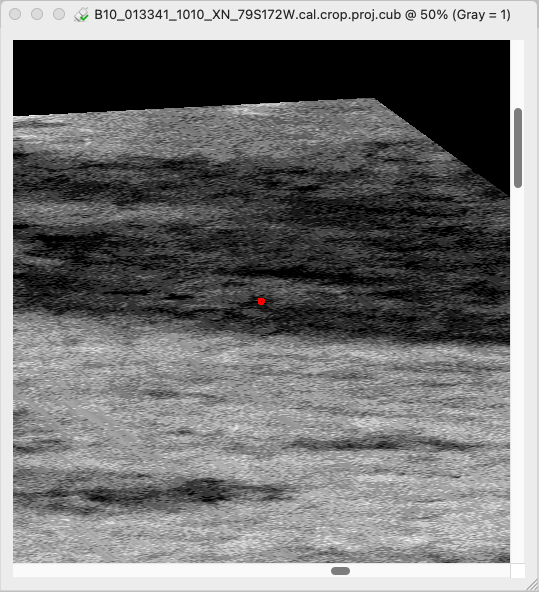
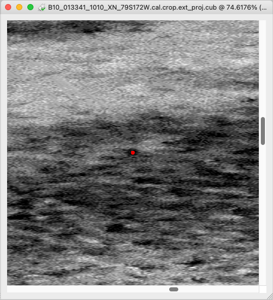

# Making Projections Using PROJ

??? warning "Understanding Projection Concepts"

    If you are unfamiliar with map projection and concepts surrounding them, please checkout [Learning About Map Projections](learning-about-map-projections.md).

This page is dedicated to using [PROJ](https://proj.org/en/stable/) in ISIS and how the two differ when paramatizing for projections

## Using PROJ in ISIS

Currently, ISIS supports using PROJ through the same [Mapping Group](learning-about-map-projections.md/#defining-a-map-in-isis3) that all ISIS projections operate with. 
The two keys that are used to define the PROJ Mapping Group from other ISIS Mapping Groups are the `ProjectionName` key, which will be set to `IProj` and the `ProjString` key. 
`ProjString` is a PROJ4 string that PROJ can read to build a projection from.

In the example below, a Equirectangular projection is defined in a ISIS IProj Mapping Group.

```
Group = Mapping
  TargetName         = Mars
  ProjectionName     = IProj
  EquatorialRadius   = 3396190.0 <meters>
  PolarRadius        = 3376200.0 <meters>
  LatitudeType       = Planetographic
  LongitudeDirection = PositiveEast
  LongitudeDomain    = 180 <degrees>
  PixelResolution    = 4.8903795322349 <meters/pixel>
  Scale              = 12120.674301984 <pixels/degree>
  UpperLeftCornerX   = -10229221.538714 <meters>
  UpperLeftCornerY   = -4669070.2968831 <meters>
  MinimumLatitude    = -78.997456490145
  MaximumLatitude    = -78.770099626405
  MinimumLongitude   = -172.57312133874
  MaximumLongitude   = -171.69395292299
  ProjStr            = "+proj=eqc +lat_ts=0 +lat_0=0 +lon_0=0 +x_0=0 +y_0=0
                        +a=3396190 +b=3376200  +units=m +no_defs +type=crs"
End_Group
```

This would be the equivalent projection using the ISIS Equirectangular Projection

```
Group = Mapping
  TargetName         = Mars
  ProjectionName     = Equirectangular
  EquatorialRadius   = 3396190.0 <meters>
  PolarRadius        = 3376200.0 <meters>
  LatitudeType       = Planetographic
  LongitudeDirection = PositiveEast
  LongitudeDomain    = 180 <degrees>
  PixelResolution    = 4.8903795322349 <meters/pixel>
  Scale              = 12120.674301984 <pixels/degree>
  UpperLeftCornerX   = -10229221.538714 <meters>
  UpperLeftCornerY   = -4669070.2968831 <meters>
  MinimumLatitude    = -78.997456490145
  MaximumLatitude    = -78.770099626405
  MinimumLongitude   = -172.57312133874
  MaximumLongitude   = -171.69395292299
  CenterLatitude     = 0.0 <degrees>
  CenterLongitude    = 0.0 <degrees>
End_Group
```

Add images of output

## Noteable differences between ISIS and PROJ

### Ographic vs Ocentric Latitudes

PROJ and ISIS approach ocentic and ographic latitudes differently. 
PROJ will always use ographic latitudes for its projections.
If your PROJ string only defines one radii, you will get ocentric latitudes for the projection since ocentric and ographic are eqaul if your semi-major and semi-minor radii are equal.

ISIS allows the user to specify ocentric or ographic latitudes independent of the projection chosen. 
Many projections in ISIS only support sphereical definitions of the projection, but the user can still specify either
ocentric or ographic latitudes.

#### Suggested Ographic and Ocentric Specifications

??? info "Same Semi-major Semi-minor radii and Ographic Latitude"

    ISIS and PROJ will produce the same output projection when using the same semi-major and semi-minor radii
    and ographic latitudes. Not all projections have been tested but both are expected to be equivalent. 
    
    Below are two images, one projected with an ISIS Projection the othe with PROJ. Both used 3396190 meters for the semi major radii, 
    3376200 meters for the semi-minor radii, and planetographic latitudes.

    <div class="grid cards" markdown>

    - [](assets/600px-isisproj-ographic.png "Projected image using ISIS Projection")  
        *Projected image using ISIS Projection*

    - [](assets/600px-PROJ-ographic.png "Projected image using PROJ")  
        *Projected image using PROJ*

    </div>


??? info "Same Semi-major radii and Ocentric Latitude"

    ISIS and PROJ will produce the same output projection when using the same semi-major radii
    and ocentric latitudes. Not all projections have been tested but both are expected to be equivalent.
    ISIS will still report the semi-minor radii but it will not be used when computing the ocentric latitude.

    Below are two images, one projected with an ISIS Projection the othe with PROJ. Both used 3396190 meters for the semi major radii, 
    and planetocentric latitudes.

    <div class="grid cards" markdown>

    - [](assets/600px-isisproj-ocentric.png "Projected image using ISIS Projection")  
        *Projected image using ISIS Projection*

    - [](assets/600px-PROJ-ocentric.png "Projected image using PROJ")  
        *Projected image using PROJ*

    </div>

### Longitude Domain

ISIS and PROJ both support -180 to 180 and 0 to 360 longitude domains. However ISIS does not play well with PROJ defined longitude domains.
In the IProj projection a domain of -180 to 180 is used when creating a mapping group and the PROJ string is not examined.

Because of this users should plan on all projections being in the -180 to 180 domain while working with ISIS. If need be,
the domain can be changed using [`gdalwarp`](https://gdal.org/en/stable/programs/gdalwarp.html). Specifically
using the `+lon_warp` and `+over` elements in the srs defition.

To convert the `input.tiff` image created with the following Proj4 string to 0 - 360 degree longitude domain:
```
+proj=eqc +lat_ts=0 +lat_0=0 +lon_0=0 +x_0=0 +y_0=0 +R=3396190 +units=m +no_defs
```

You would use the following command:
```
gdalwarp input.tiff output.tiff -t_srs '+proj=eqc +lat_ts=0 +lat_0=0 +lon_0=180 +x_0=0 +y_0=0 +R=3396190 +units=m +no_defs +lon_warp=180 +over'
```

### Longitude Direction

ISIS and PROJ both support Positive East and Positive West longitude directions. However ISIS does not play well with PROJ defined longitude directions.
In the IProj projection longitude direction of Positve East is used when creating a mapping group and the PROJ string is not examined.

Because of this users should plan on all projections using a Positive East longitude direction while working with ISIS. If need be,
the longitude direction can be changed using [`gdalwarp`](https://gdal.org/en/stable/programs/gdalwarp.html). Specifically
using the `+axis` element in the srs defition.

To convert the `input.tiff` image created with the following Proj4 string to positve west:
```
+proj=eqc +lat_ts=0 +lat_0=0 +lon_0=0 +x_0=0 +y_0=0 +R=3396190 +units=m +no_defs
```

You would use the following command:
```
gdalwarp input.tiff output.tiff -t_srs '+proj=eqc +lat_ts=0 +lat_0=0 +lon_0=0 +x_0=0 +y_0=0 +R=3396190 +units=m +no_defs +axis=wnu'
```