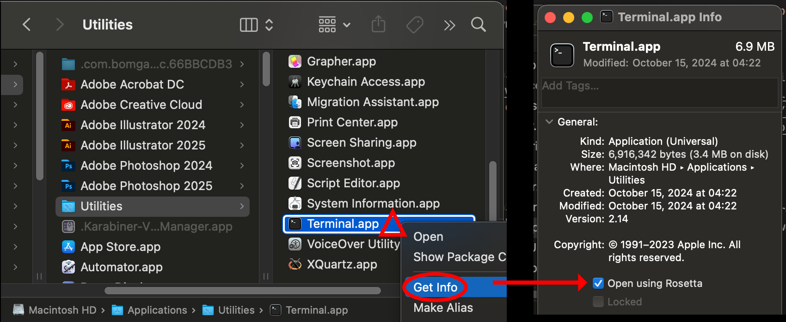

# ISIS Development on ARM Macs (Apple Silicon)

*Initially borrowed from [Kris Becker's GitHub post](https://github.com/DOI-USGS/ISIS3/issues/5188).*

There two ways to develop ISIS on Apple Silicon. ISIS can be built on ARM Macs with Rosetta Translation, using the x86 instruction set. Building ISIS natively for ARM on Apple Silicon is not as reliable. The instructions for both ways are provided here, but for now, the x86 environment is recommended, and ARM builds are considered experimental.


## Rosetta, the Terminal, and Conda

Building ISIS requires Conda.  The installation of Conda will depend on whether your terminal is running natively on ARM or with x86 translation.  Whether your terminal is running natively or on ARM depends on Rosetta.  This means you should proceed in this order:

1.  Install Rosetta
1.  Set up a terminal to use Rosetta
1.  Install Conda in the Rosetta Terminal
1.  Use a Conda environment to build and run ISIS

Apple's [Rosetta Translation Environment](https://developer.apple.com/documentation/apple-silicon/about-the-rosetta-translation-environment) runs applications that use the Intel-based x86_64 instruction set. Using Rosetta, ISIS can be compiled and run on Apple Silicon.

There are a few ways to set up the Rosetta environment.  We recommend getting a second terminal and configuring it to run in Rosetta as described below.  Alternatively, [Taylor Reiter's blog](https://taylorreiter.github.io/2022-04-05-Managing-multiple-architecture-specific-installations-of-conda-on-apple-M1/) shows how to set up an ARM miniforge and an x86 miniconda environment side by side.  [Conda Forge](https://conda-forge.org/docs/user/tipsandtricks/#installing-apple-intel-packages-on-apple-silicon) has a instructions for enabling Rosetta on a per-conda-environment basis.

!!! warning "Using different terminals"

    Some sources initially suggested making a *copy* of the terminal app so you can use your initial terminal for ARM environments and the copied terminal for x86 environments.  On recent versions of macOS, copying the included `Terminal.app` has been reported not to work, or to cause complications.  A copied app may be removed when updating.
    
    A similar setup can be achieved by installing a second, third party terminal like [iTerm2](https://iterm2.com), and this is now recommended instead.

Once your terminal is set up, building ISIS will require a conda environment, as described in [Anaconda and ISIS dependencies](https://astrogeology.usgs.gov/docs/how-to-guides/isis-developer-guides/developing-isis3-with-cmake/#anaconda-and-isis3-dependencies).


## Setting Up a Rosetta Terminal

A Rosetta Terminal is a terminal run inside the Rosetta translation layer.  This gives you an terminal environment to run x86 apps in on Macs with ARM processors.  Here's how to set it up:

1.  Install Rosetta (accepting its license terms):

    `/usr/sbin/softwareupdate --install-rosetta --agree-to-license`

1.  Get a second terminal.
    -   Installing a third party terminal like [iTerm2](https://iterm2.com) is recommended.
    -   3rd-party Terminal + mac-included Terminal.app = 2 terminals.
    -   You will probably want 2 terminals so you can run native ARM apps in one and x86 apps in the other!

1.  Pick one terminal to be your **ARM native terminal**, and the other to be your **x86 Rosetta Terminal**.

1.  For the **x86 Rosetta Terminal**, right click the app in the `/Applications` (or `/Applications/Utilities`) folder, and click `Get Info`.

1.  Check the `Open using Rosetta` box.  This is now your Rosetta Terminal.




## Installing Miniconda on a Rosetta Terminal

1. Run the `Rosetta Terminal` app (the x86 Terminal you set up above).
    * `uname -m` should report `x86_64`
2. Install the Bash version of [Mac Intel Miniconda](https://repo.anaconda.com/miniconda/Miniconda3-latest-MacOSX-x86_64.sh)
    * `bash Miniconda3-latest-MacOSX-x86_64.sh`
3. Configure conda according to the ISIS installation instructions. This is mainly to setup the proper channels and establish priority.
    * `conda config --env --add channels conda-forge`
    * `conda config --env --add channels usgs-astrogeology`
4. Create a directory and install ISIS from GitHub
    * `mkdir -p IsisMacIntel`
    * `cd IsisMacIntel`
    * `git clone --recurse-submodules https://github.com/DOI-USGS/ISIS3.git`
5. Build ISIS using the instructions as documented [here.](https://astrogeology.usgs.gov/docs/how-to-guides/isis-developer-guides/developing-isis3-with-cmake/)
    * `ninja install`

The build times are quite impressive - 11 minutes - using the Rosetta Translation Environment. Behavior is similar to other Mac platforms since ISIS installs/uses the Anaconda [cpp-compiler](https://anaconda.org/conda-forge/cxx-compiler).


## Mac M1 Native x86_arm64 ARM Configuration Steps

Building the ARM version of ISIS is easier than the Intel version because 
there are no additional special setup requirements as there are for Rosetta. 
However, ARM still tends to be a bit less supported than x86 as of 2024. 

If the Rosetta Intel installation above was followed, that environment must be removed. 
(Alternative Procedures [[Side-by-side]](https://taylorreiter.github.io/2022-04-05-Managing-multiple-architecture-specific-installations-of-conda-on-apple-M1/) 
[[Per-conda-env]](https://conda-forge.org/docs/user/tipsandtricks/#installing-apple-intel-packages-on-apple-silicon) 
may let you keep Rosetta x86 and native ARM environments simultaneosly.) 
To remove a Miniconda installation, follow  
[Conda's docs](https://docs.conda.io/projects/conda/en/latest/user-guide/install/macos.html#uninstalling-anaconda-or-miniconda). 

Open a native Terminal and prepare to 
[install](https://conda.io/projects/conda/en/stable/user-guide/install/macos.html#install-macos) the ARM version of Miniconda:

1. Ensure you are running the native Terminal app.
    * `uname -m` should report `arm64`
2. Install the Bash version of Mac Native ARM Miniconda
    * `bash Miniconda3-latest-MacOSX-arm64.sh`
3. Configure conda properly
    * `conda config --env --add channels conda-forge`
    * `conda config --env --add channels usgs-astrogeology`
4. Create a directory and install ISIS from GitHub
    * `mkdir -p IsisMacARM`
    * `cd IsisMacARM`
    * `git clone --recurse-submodules https://github.com/DOI-USGS/ISIS3.git`
5. Configure ISIS
    * `conda env create -n IsisArmDev -f environment.yml`

!!! warning "GUI Applications not Visible?"

    As reported in [issue #4773](https://github.com/DOI-USGS/ISIS3/issues/4773), 
    GUI (Qt) applications may not display until you run the following in your terminal:

    ```sh
    export QT_MAC_WANTS_LAYER=1
    ```


## Concluding Remarks

It is possible to use the Apple ARM platform to develop ISIS applications.  For now, you may need Rosetta to translate.  ARM Support continues to evolve.

Amazon provides [EC2 Mac instances](https://aws.amazon.com/ec2/instance-types/mac/), which include Apple ARM systems with macOS installed; a possiblity for ISIS ARM development.

